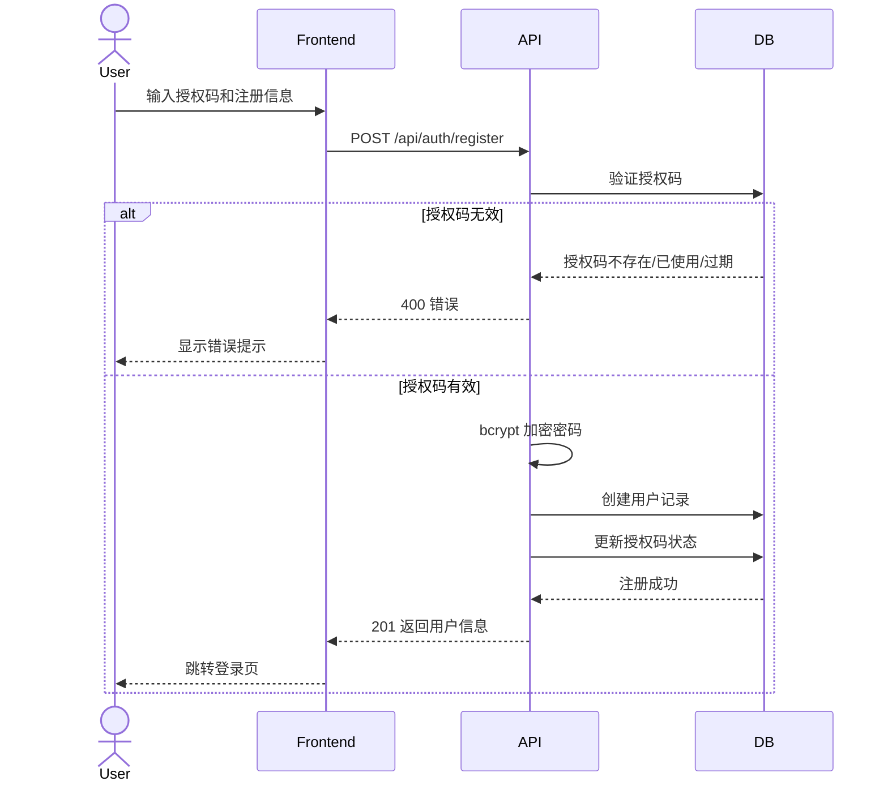
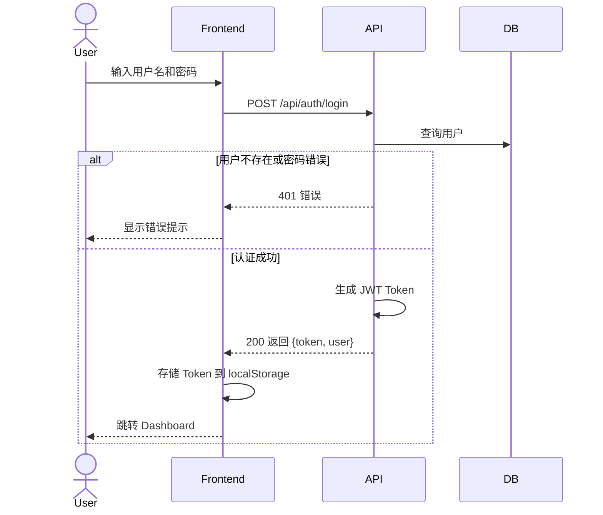
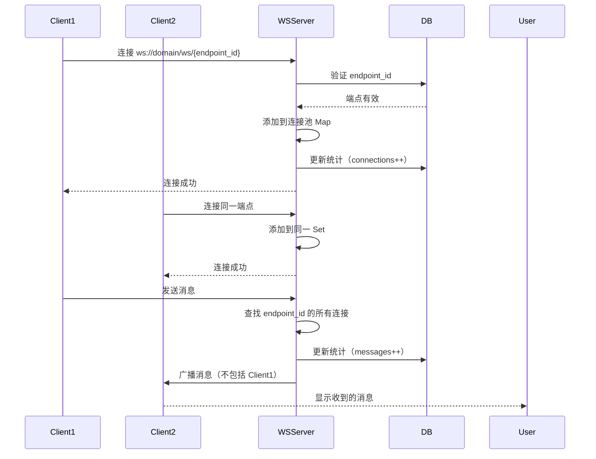

# Core Workflows

## 用户注册流程

```mermaid
sequenceDiagram
    actor User
    participant Frontend
    participant API
    participant DB

    User->>Frontend: 输入授权码和注册信息
    Frontend->>API: POST /api/auth/register
    API->>DB: 验证授权码
    alt 授权码无效
        DB-->>API: 授权码不存在/已使用/过期
        API-->>Frontend: 400 错误
        Frontend-->>User: 显示错误提示
    else 授权码有效
        API->>API: bcrypt 加密密码
        API->>DB: 创建用户记录
        API->>DB: 更新授权码状态
        DB-->>API: 注册成功
        API-->>Frontend: 201 返回用户信息
        Frontend-->>User: 跳转登录页
    end
```

## 用户登录和认证流程

```mermaid
sequenceDiagram
    actor User
    participant Frontend
    participant API
    participant DB

    User->>Frontend: 输入用户名和密码
    Frontend->>API: POST /api/auth/login
    API->>DB: 查询用户
    alt 用户不存在或密码错误
        API-->>Frontend: 401 错误
        Frontend-->>User: 显示错误提示
    else 认证成功
        API->>API: 生成 JWT Token
        API-->>Frontend: 200 返回 {token, user}
        Frontend->>Frontend: 存储 Token 到 localStorage
        Frontend-->>User: 跳转 Dashboard
    end
```

## WebSocket 连接和消息转发流程

```mermaid
sequenceDiagram
    participant Client1
    participant Client2
    participant WSServer
    participant DB

    Client1->>WSServer: 连接 ws://domain/ws/{endpoint_id}
    WSServer->>DB: 验证 endpoint_id
    DB-->>WSServer: 端点有效
    WSServer->>WSServer: 添加到连接池 Map
    WSServer->>DB: 更新统计（connections++）
    WSServer-->>Client1: 连接成功

    Client2->>WSServer: 连接同一端点
    WSServer->>WSServer: 添加到同一 Set
    WSServer-->>Client2: 连接成功

    Client1->>WSServer: 发送消息
    WSServer->>WSServer: 查找 endpoint_id 的所有连接
    WSServer->>DB: 更新统计（messages++）
    WSServer->>Client2: 广播消息（不包括 Client1）
    Client2-->>User: 显示收到的消息
```

---
