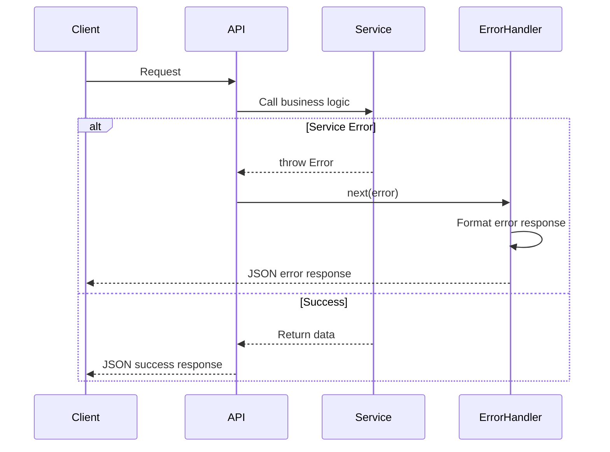

# Error Handling Strategy

## Error Flow



## Error Response Format

```typescript
interface ApiError {
  error: {
    code: string;           // ERROR_CODE
    message: string;        // 用户友好消息
    details?: Record<string, any>;
    timestamp: string;
    requestId: string;
  };
}
```

## Backend Error Handling

```typescript
// src/middleware/errorHandler.ts
export const errorHandler = (err: any, req: Request, res: Response, next: NextFunction) => {
  const statusCode = err.statusCode || 500;
  const message = err.message || 'Internal Server Error';

  res.status(statusCode).json({
    error: {
      code: err.code || 'INTERNAL_ERROR',
      message,
      details: process.env.NODE_ENV === 'development' ? err.stack : undefined,
      timestamp: new Date().toISOString(),
      requestId: req.id,
    },
  });
};
```

## Frontend Error Handling

```typescript
// src/services/api.ts
apiClient.interceptors.response.use(
  (response) => response.data,
  (error) => {
    if (error.response?.status === 401) {
      localStorage.removeItem('token');
      window.location.href = '/login';
    }
    const errorMessage = error.response?.data?.error?.message || '网络请求失败';
    message.error(errorMessage);
    return Promise.reject(error);
  }
);
```

---
