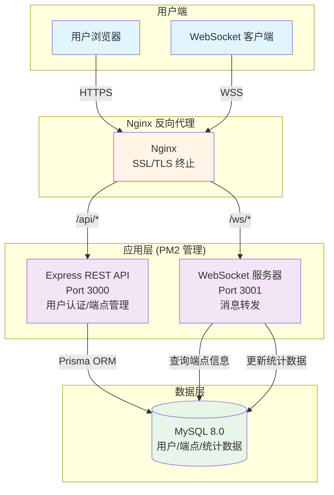

# High Level Architecture

## Technical Summary

本系统采用**单体架构 + 独立 WebSocket 服务**的混合部署方案，前后端通过 Monorepo 统一管理。前端使用 React 18 + Vite 构建 SPA 应用，通过 Ant Design 5.x 提供一致的 UI 体验。后端由两个独立进程组成：Express REST API 服务处理用户认证和端点 CRUD 操作，ws 原生 WebSocket 服务器负责高性能实时消息转发。数据层使用 MySQL 8.0 存储持久化数据，通过 Prisma ORM 提供类型安全的数据访问。整体架构以简单、可维护为核心设计原则，优先满足 MVP 的性能需求（<100ms 消息延迟，支持 10 个端点和每端点 5 个并发连接）。

## Platform and Infrastructure Choice

基于 PRD 的成本可控和单服务器部署需求，推荐以下平台方案：

**推荐方案：自管理 VPS（MVP 最佳选择）**

- **平台**：DigitalOcean Droplet / Vultr High Frequency / Linode
- **配置**：2 vCPU, 4GB RAM, 80GB SSD
- **区域**：选择离目标用户最近的区域
- **操作系统**：Ubuntu 22.04 LTS
- **月成本**：$10-20

**优势：**
- 成本最低，完全控制权
- 简单直接的部署流程
- 适合 MVP 验证阶段
- 可平滑迁移到云服务（未来扩展）

**核心服务清单：**
- **Web 服务器**：Nginx（反向代理 + 静态文件托管 + SSL 终止）
- **应用运行时**：Node.js 20.x LTS
- **进程管理**：PM2（管理 API 和 WebSocket 进程）
- **数据库**：MySQL 8.0（本地安装）
- **SSL 证书**：Let's Encrypt（通过 Certbot 自动续期）

## Repository Structure

**结构选择**：Monorepo（单一代码仓库）
**工具**：pnpm workspace
**包组织策略**：按应用类型（apps）和共享代码（packages）分层

**包组织：**
```
packages/
├── frontend/          # React SPA 应用
├── backend/           # Express API + WebSocket 服务器
└── shared/            # 共享 TypeScript 类型和工具函数
```

**理由：**
- PRD 明确推荐 Monorepo + pnpm workspace
- 前后端共享 TypeScript 类型定义（存放在 `packages/shared`）
- 统一依赖管理，避免版本冲突
- 单一代码仓库便于 CI/CD 配置

## High Level Architecture Diagram



**架构说明：**
1. **用户入口**：所有流量通过 Nginx 统一接入（HTTPS/WSS 加密）
2. **路由分离**：`/api/*` 路由到 REST API，`/ws/{endpoint_id}` 路由到 WebSocket 服务器
3. **进程隔离**：API 和 WebSocket 服务独立运行，互不影响
4. **共享数据库**：两个服务都连接同一 MySQL 实例，通过 Prisma 统一访问

## Architectural Patterns

以下是指导全栈开发的关键架构模式：

**整体架构模式：**

- **Monolithic + Microservice Hybrid** - 核心业务（API）采用单体架构简化开发，WebSocket 服务独立进程实现关注点分离。
  _理由：_ MVP 阶段避免微服务复杂度，但 WebSocket 服务独立便于水平扩展和故障隔离。

- **RESTful API + WebSocket Dual Protocol** - HTTP REST 处理 CRUD 操作，WebSocket 处理实时通信。
  _理由：_ REST 适合幂等操作和资源管理，WebSocket 适合双向实时消息推送，各取所长。

**前端架构模式：**

- **Component-Based Architecture** - 基于 React + Ant Design 构建可复用 UI 组件。
  _理由：_ 符合现代前端最佳实践，Ant Design 提供企业级组件库，减少重复开发。

- **Context API State Management** - 使用 React Context 管理全局状态（用户认证、端点列表）。
  _理由：_ MVP 阶段状态简单，Context API 足够且无需额外依赖。

- **Client-Side Routing** - 使用 React Router 实现 SPA 路由。
  _理由：_ 提供流畅的单页面应用体验，减少页面刷新。

**后端架构模式：**

- **Repository Pattern** - 通过 Prisma ORM 抽象数据访问逻辑。
  _理由：_ 分离业务逻辑和数据访问，便于测试和未来数据库迁移。

- **Middleware Pipeline** - Express 中间件链处理认证、CORS、错误处理。
  _理由：_ 横切关注点统一处理，符合 Express 设计理念。

- **JWT Token Authentication** - 无状态认证机制，Token 存储在客户端。
  _理由：_ 适合 REST API，无需服务器端会话存储，易于水平扩展。

**WebSocket 特定模式：**

- **Pub/Sub Message Routing** - 基于 endpoint_id 的内存 Map 路由消息。
  _理由：_ 简单高效，MVP 阶段无需引入 Redis 等外部消息队列。

- **Connection Pool Management** - 每个 endpoint 维护一个 Set<WebSocket> 连接集合。
  _理由：_ 内存结构简单，查找和广播效率高。

**集成与部署模式：**

- **Single Server Deployment** - 所有服务部署在一台 VPS 上。
  _理由：_ 成本最优，MVP 性能需求可满足，简化运维。

- **Process Manager Pattern** - PM2 管理多个 Node.js 进程。
  _理由：_ 自动重启、日志管理、资源监控，生产环境标准做法。

- **Reverse Proxy Pattern** - Nginx 作为统一入口。
  _理由：_ SSL 终止、静态文件托管、负载均衡（未来扩展），标准 Web 架构模式。

---
