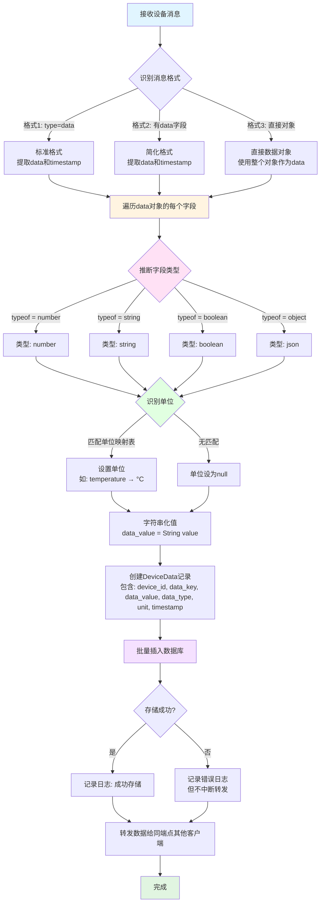
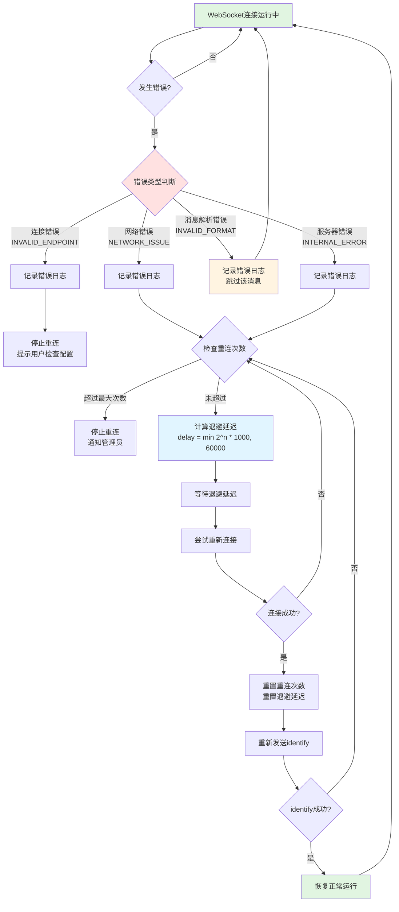
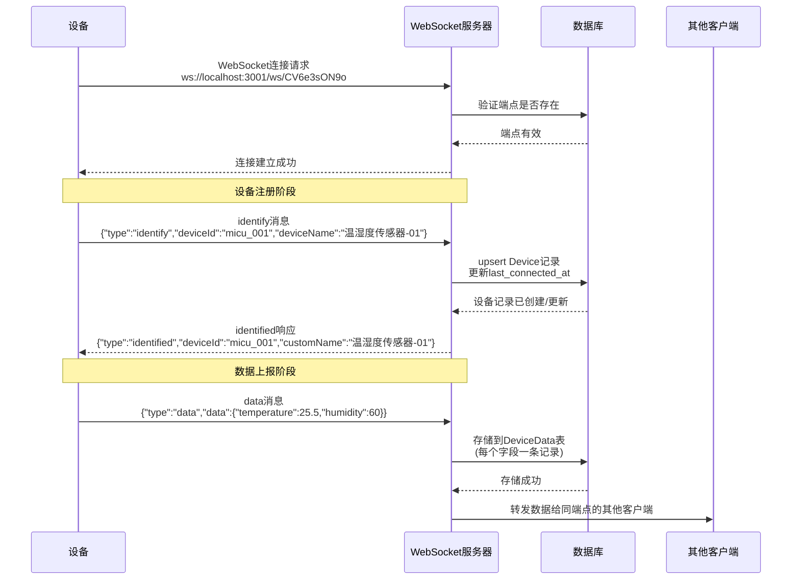
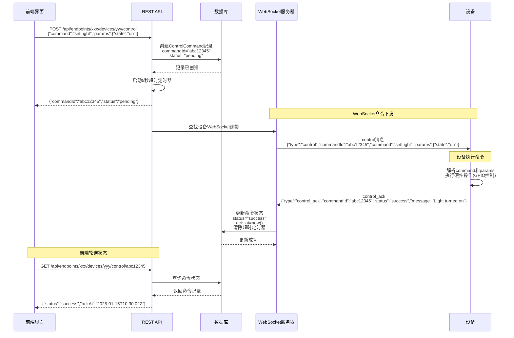

# WebSocket 中继平台 - 下位机与后端通信协议完整规范

**版本**: 1.5.2
**更新日期**: 2025-11-02
**维护者**: 米醋电子工作室 (Michu Electronics Studio)
**GitHub**: McuXifeng
**邮箱**: 3531313387@qq.com

**版本更新说明**:
- ✅ 【v1.5.2】新增4个Mermaid流程图,大幅提升文档可读性:
  - 设备初次连接完整流程图(时序图) - 第12.1节
  - 控制命令完整流程图(时序图) - 第12.2节
  - 数据解析完整流程图(流程图) - 第8.1.1节
  - 错误处理和重连流程图(流程图) - 第9.3.1节
- ✅ 【v1.5.2】前端支持Mermaid图表渲染,图表支持响应式布局
- ✅ 【协议简化 v1.5.1】明确 timestamp 字段在所有设备上报消息中均为**可选**,服务器自动填充
- ✅ 【协议简化 v1.5.1】identified 响应不包含 timestamp 字段,减少不必要的数据传输
- ✅ 【协议简化 v1.5.1】control_ack 消息的 commandId 字段为**可选**,服务器通过时间窗口匹配自动关联
- ✅ 【协议简化 v1.5.1】新增时间窗口匹配机制(5秒内最新pending指令),简化资源受限设备的开发
- ✅ 增强第六章"响应协议",详细说明 identified、system、error 响应类型
- ✅ 新增第七章"请求协议",支持设备主动发起请求(config_query、status_sync、data_sync)
- ✅ 新增第八章"数据解析",详细说明服务器端数据解析、类型推断、单位识别和存储策略
- ✅ 为所有响应类型添加完整的字段说明表格和边界情况处理
- ✅ 扩充FAQ章节从5个问题增加到12个,覆盖网络不稳定、性能优化、OTA升级等常见问题
- ✅ 完善单位识别映射表,新增14种常见物理量单位
- ✅ 优化数据查询策略,提供索引设计、分页查询、聚合查询示例

---

## 一、协议概览

WebSocket 中继平台是一个双向通信系统，用于 IoT 设备与服务器的实时数据交互。

### 核心参数

| 参数 | 值 | 说明 |
|------|-----|------|
| WebSocket 服务器端口 | 3001 | WebSocket 服务监听端口 |
| 连接 URL 格式 | `ws://localhost:3001/ws/{endpoint_id}` | 端点标识符作为路径参数 |
| 消息格式 | JSON/DIRECT/CUSTOM_HEADER | 支持多种消息格式 |
| 心跳间隔 | 30 秒 | 服务器主动发送 ping |
| 命令超时 | 5 秒 | 控制命令响应超时时间 |

---

## 二、连接协议

### 2.1 连接建立

**URL 格式及验证：**

```
ws://localhost:3001/ws/CV6e3sON9o
                    └──────────┘
                    endpoint_id
```

**连接流程：**

1. 客户端发起 WebSocket 连接
2. 服务器解析 URL，提取 `endpoint_id`（正则表达式：`/^\/ws\/([a-zA-Z0-9-]+)$/`）
3. 查询数据库验证 `endpoint_id` 是否存在
4. **有效**：建立连接，存储 `endpointId` 和 `endpoint` 数据到 socket 对象
5. **无效**：发送错误消息，关闭连接（WebSocket 代码 1008）

**错误响应示例：**

```json
{
  "type": "system",
  "level": "error",
  "message": "Invalid endpoint",
  "timestamp": 1635316800000
}
```

### 2.2 连接对象属性

服务器为每个连接维护的扩展属性：

| 属性 | 类型 | 说明 |
|------|------|------|
| `endpointId` | string | 端点标识符 (UUID) |
| `endpoint` | Endpoint | 端点数据库对象 |
| `deviceId` | string | 设备标识符（如 "micu"） |
| `dbDeviceId` | string | 设备数据库 UUID |
| `customName` | string | 设备自定义名称 |
| `isAlive` | boolean | 心跳检测标志 |
| `isCleanedUp` | boolean | 连接清理标记 |

---

## 三、设备注册协议

### 3.1 设备标识消息（identify）

设备连接后**首先**发送标识消息：

```json
{
  "type": "identify",
  "deviceId": "micu",
  "deviceName": "我的 MICU 设备"
}
```

**字段说明：**

| 字段 | 类型 | 必需 | 限制 | 说明 |
|------|------|------|------|------|
| type | string | ✅ | 固定值 "identify" | 消息类型 |
| deviceId | string | ✅ | 最大 64 字符 | 设备唯一标识符 |
| deviceName | string | ❌ | 最大 100 字符 | 设备自定义名称 |

### 3.2 服务器确认响应（identified）

服务器收到 identify 后返回确认：

```json
{
  "type": "identified",
  "deviceId": "micu",
  "customName": "我的 MICU 设备",
  "dbDeviceId": "a1b2c3d4-e5f6-7890-abcd-ef1234567890"
}
```

> **💡 提示**: identified 响应**不包含** timestamp 字段,这是为了简化协议,减少不必要的字段传输。

### 3.3 数据库操作

执行 `upsert` 操作：

- **如果设备已存在**：更新 `last_connected_at` 时间戳
- **如果设备不存在**：创建新记录
  - `custom_name` 默认为 `"设备-{deviceId前4位}"`
  - 例如：deviceId = "micu1234" → customName = "设备-micu"

**Upsert 条件：**

```typescript
where: {
  endpoint_id_device_id: {
    endpoint_id: endpoint.id,    // 端点 UUID
    device_id: deviceId          // 设备标识符，如 "micu"
  }
}
```

---

## 四、数据上报协议

> **🎯 协议简化要点**:
> - ✅ timestamp 字段是**可选的**,设备端可以不提供
> - ✅ 如果设备不提供 timestamp,服务器会自动使用当前时间 (Date.now())
> - ✅ 这样可以大幅简化设备端代码,特别是对于资源受限的嵌入式设备

### 4.1 支持三种消息格式

服务器会自动识别和处理以下三种格式：

#### 格式 1：标准数据消息（推荐）

```json
{
  "type": "data",
  "data": {
    "temperature": 25.5,
    "humidity": 60,
    "voltage": 12.3,
    "status": "online"
  }
}
```

> **💡 协议简化**: timestamp 字段是**可选的**,如果设备不提供,服务器会自动使用当前时间戳 (Date.now())。这样可以减少设备端的复杂度。

**可选时间戳示例**:
```json
{
  "type": "data",
  "data": {
    "temperature": 25.5,
    "humidity": 60
  },
  "timestamp": 1635316800000
}
```

#### 格式 2：简化格式

```json
{
  "data": {
    "temperature": 25.5,
    "humidity": 60
  }
}
```

> **💡 提示**: 格式 2 同样支持可选的 timestamp 字段,如果不提供则由服务器自动填充。

#### 格式 3：直接数据对象（最简化）

```json
{
  "temperature": 25.5,
  "humidity": 60,
  "voltage": 12.3
}
```

> **💡 提示**: 格式 3 不支持 timestamp 字段,服务器会自动使用接收时的时间戳。适合资源受限的嵌入式设备。

### 4.2 数据类型和单位识别

#### 自动推断单位映射

| 字段名称 | 自动单位 |
|----------|---------|
| temperature, temp | °C |
| humidity | % |
| voltage, volt | V |
| current | A |
| pressure | Pa |

#### 支持的数据类型

| 数据类型 | 说明 | 存储方式 |
|---------|------|---------|
| number | 数值型 | 字符串化存储 |
| string | 字符串型 | 直接存储 |
| boolean | 布尔型 | "true" / "false" |
| object | 复杂对象 | JSON.stringify() |

### 4.3 DeviceData 表存储

每个数据字段都会作为一条记录存储：

| 字段 | 类型 | 说明 | 示例 |
|------|------|------|------|
| id | UUID | 主键 | "a1b2c3..." |
| device_id | UUID | 设备数据库 UUID | "d4e5f6..." |
| data_key | string | 字段名 | "temperature" |
| data_value | string | 值（字符串形式） | "25.5" |
| data_type | string | 类型 | "number" |
| unit | string | 单位 | "°C" |
| timestamp | datetime | 数据时间戳 | 2025-01-15 10:30:00 |

**索引：**

```sql
@@index([device_id, data_key, timestamp])
```

### 4.4 数据处理流程

```
1. 接收原始消息
   ↓
2. 解析格式（格式1/2/3）
   ↓
3. 提取 data 字段
   ↓
4. 遍历每个键值对
   ↓
5. 推断数据类型 (typeof value)
   ↓
6. 识别单位（根据字段名）
   ↓
7. 批量插入 DeviceData 表
   ↓
8. 根据端点转发模式转发给其他客户端
```

**注意事项：**

- 数据存储失败**不会中断**消息转发
- 错误会被记录到日志
- 异步批量插入，提高性能

---

## 五、控制命令协议

### 5.1 控制消息格式

后端通过 HTTP API 接收控制请求，经 WebSocket 转发到设备：

```json
{
  "type": "control",
  "commandId": "abc12345",
  "deviceId": "micu",
  "command": "setLight",
  "params": {
    "state": "on",
    "brightness": 100
  },
  "timestamp": 1635316800000
}
```

**字段说明：**

| 字段 | 类型 | 必需 | 说明 |
|------|------|------|------|
| type | string | ✅ | 固定值 "control" |
| commandId | string | ✅ | 指令 ID（8 位 nanoid，全局唯一） |
| deviceId | string | ✅ | 目标设备标识符 |
| command | string | ✅ | 指令类型（应用层自定义） |
| params | object | ✅ | 指令参数 |
| timestamp | number | ✅ | 服务器时间戳（Unix 毫秒，**由服务器自动添加**） |

### 5.2 常见指令示例

#### 开关灯

```json
{
  "type": "control",
  "commandId": "cmd_001",
  "deviceId": "light_01",
  "command": "setLight",
  "params": {
    "state": "on"
  }
}
```

#### 调节温度

```json
{
  "type": "control",
  "commandId": "cmd_002",
  "deviceId": "thermostat_01",
  "command": "setTemperature",
  "params": {
    "temperature": 26,
    "mode": "cool"
  }
}
```

#### 调节亮度

```json
{
  "type": "control",
  "commandId": "cmd_003",
  "deviceId": "light_01",
  "command": "setBrightness",
  "params": {
    "brightness": 75
  }
}
```

### 5.3 HTTP API 端点

**发送控制命令：**

```http
POST /api/endpoints/{endpointId}/devices/{deviceId}/control
Content-Type: application/json
Authorization: Bearer {token}

请求体：
{
  "command": "setLight",
  "params": { "state": "on" }
}

响应：
{
  "commandId": "abc12345",
  "status": "pending",
  "sentAt": "2025-01-15T10:30:00Z"
}
```

**查询命令状态：**

```http
GET /api/endpoints/{endpointId}/devices/{deviceId}/control/{commandId}
Authorization: Bearer {token}

响应：
{
  "commandId": "abc12345",
  "status": "success",
  "sentAt": "2025-01-15T10:30:00Z",
  "ackAt": "2025-01-15T10:30:02Z"
}
```

### 5.4 发送流程

```
前端/客户端
   ↓
HTTP POST /api/endpoints/:id/devices/:id/control
   ↓
创建 ControlCommand 记录 (status: pending)
   ↓
生成 WebSocket 控制消息
   ↓
查找目标设备的 WebSocket 连接
   ↓
点对点发送到设备 (if 设备在线)
   ↓
启动 5 秒超时定时器
   ↓
返回 commandId 给客户端
   ↓
客户端轮询：GET /api/endpoints/:id/devices/:id/control/:commandId
   ↓
获取当前状态（pending → success/failed/timeout）
```

### 5.5 ControlCommand 表结构

| 字段 | 类型 | 说明 |
|------|------|------|
| id | UUID | 主键 |
| endpoint_id | UUID | 端点 UUID |
| device_id | UUID | 设备 UUID |
| command_id | string | 指令 ID（nanoid 8 位，唯一索引） |
| command_type | string | 指令类型（如 "setLight"） |
| command_params | text | 参数 JSON |
| status | string | pending/success/failed/timeout |
| sent_at | datetime | 发送时间 |
| ack_at | datetime | 应答时间（可为空） |
| timeout_at | datetime | 超时时间（可为空） |
| error_message | text | 错误信息（可为空） |

**索引：**

```sql
@@index([device_id, sent_at])
@@index([command_id])
@@index([status])
```

---

## 六、响应协议

服务器会向设备发送多种类型的响应消息,用于确认操作、通知系统状态和报告错误。

### 6.1 设备注册确认响应（identified）

#### 6.1.1 消息格式

设备发送 `identify` 消息后，服务器返回确认响应：

```json
{
  "type": "identified",
  "deviceId": "micu",
  "customName": "我的 MICU 设备",
  "dbDeviceId": "a1b2c3d4-e5f6-7890-abcd-ef1234567890"
}
```

**字段说明：**

| 字段 | 类型 | 必需 | 说明 |
|------|------|------|------|
| type | string | ✅ | 固定值 "identified" |
| deviceId | string | ✅ | 设备标识符（与 identify 消息中的相同） |
| customName | string | ✅ | 设备自定义名称（从数据库获取） |
| dbDeviceId | string | ✅ | 设备数据库 UUID（用于后续数据关联） |

> **💡 协议简化**: identified 响应不包含 timestamp 字段,减少不必要的数据传输。

#### 6.1.2 使用场景

1. **首次注册**: 设备第一次连接并发送 identify
2. **重复注册**: 设备重新发送 identify（更新 last_connected_at）
3. **断线重连**: 设备断线后重新连接并发送 identify

#### 6.1.3 边界情况处理

**场景 1: 设备重复发送 identify**

```
设备第一次 identify
  ↓
服务器返回 identified
  ↓
设备再次 identify（重复）
  ↓
服务器更新 last_connected_at
  ↓
服务器返回 identified（customName 保持不变）
```

**场景 2: 断线重连后的 identify**

```
设备断线
  ↓
WebSocket 连接关闭
  ↓
设备重新建立 WebSocket 连接
  ↓
设备发送 identify
  ↓
服务器查询 Device 表（已存在）
  ↓
服务器更新 last_connected_at
  ↓
服务器返回 identified
```

> **💡 提示**: 设备应在每次 WebSocket 连接建立后立即发送 identify，即使设备之前已经注册过。

---

### 6.2 系统消息响应（system）

#### 6.2.1 消息格式

服务器使用 `system` 消息通知设备系统状态、警告或错误：

```json
{
  "type": "system",
  "level": "info" | "warning" | "error",
  "message": "系统消息内容",
  "code": "ERROR_CODE",
  "timestamp": 1635316800000
}
```

**字段说明：**

| 字段 | 类型 | 必需 | 说明 |
|------|------|------|------|
| type | string | ✅ | 固定值 "system" |
| level | string | ✅ | 消息级别: info / warning / error |
| message | string | ✅ | 人类可读的消息内容 |
| code | string | ❌ | 错误代码（仅 error 级别时存在） |
| timestamp | number | ✅ | 服务器时间戳（Unix 毫秒，**由服务器自动添加**） |

#### 6.2.2 三种消息级别

**Info 级别**: 通知性消息，无需特殊处理

```json
{
  "type": "system",
  "level": "info",
  "message": "Device successfully registered",
  "timestamp": 1635316800000
}
```

**Warning 级别**: 警告消息，建议设备记录日志

```json
{
  "type": "system",
  "level": "warning",
  "message": "Message rate limit approaching: 80/100 messages per minute",
  "timestamp": 1635316800000
}
```

**Error 级别**: 错误消息，设备应处理或记录

```json
{
  "type": "system",
  "level": "error",
  "message": "Invalid endpoint",
  "code": "INVALID_ENDPOINT",
  "timestamp": 1635316800000
}
```

#### 6.2.3 常见系统消息

| level | message | code | 说明 | 处理建议 |
|-------|---------|------|------|---------|
| error | Invalid endpoint | INVALID_ENDPOINT | 端点不存在或已禁用 | 连接将被关闭，检查 endpoint_id |
| error | Invalid URL format | INVALID_URL_FORMAT | URL 格式错误 | 检查连接 URL 格式 |
| error | Invalid data format | INVALID_DATA_FORMAT | 数据格式错误 | 检查消息 JSON 格式 |
| warning | Message rate limit approaching | RATE_LIMIT_WARNING | 接近速率限制 | 降低消息发送频率 |
| info | Device successfully registered | - | 设备注册成功 | 无需处理 |

---

### 6.3 错误响应详解

#### 6.3.1 错误代码总览

服务器使用错误代码标识特定的错误类型：

**连接相关错误**

| 错误代码 | WebSocket Code | 说明 | 处理建议 |
|---------|----------------|------|---------|
| INVALID_URL_FORMAT | 1008 | URL 格式错误，无法解析 endpoint_id | 检查 URL 格式: `ws://host:port/ws/{endpoint_id}` |
| INVALID_ENDPOINT | 1008 | 端点不存在或已被禁用 | 验证 endpoint_id 有效性，联系管理员 |
| INTERNAL_SERVER_ERROR | 1011 | 服务器内部错误 | 稍后重试，持续失败则联系技术支持 |

**设备相关错误**

| 错误代码 | HTTP Code | 说明 | 处理建议 |
|---------|-----------|------|---------|
| DEVICE_OFFLINE | 503 | 设备离线，无法发送控制命令 | 等待设备上线或通知用户 |
| DEVICE_NOT_FOUND | 404 | 设备不存在（未发送过 identify） | 设备需先发送 identify 注册 |

**指令相关错误**

| 错误代码 | HTTP Code | 说明 | 处理建议 |
|---------|-----------|------|---------|
| INVALID_COMMAND | 400 | 指令格式错误或缺少必需字段 | 检查 command 和 params 字段 |
| COMMAND_TIMEOUT | 504 | 指令超时（5 秒内未收到 ACK） | 重试或检查设备连接状态 |
| COMMAND_FAILED | 500 | 设备报告执行失败 | 查看 error_message 字段获取详情 |

**数据相关错误**

| 错误代码 | HTTP Code | 说明 | 处理建议 |
|---------|-----------|------|---------|
| INVALID_DATA_FORMAT | 400 | 数据格式错误，无法解析 | 检查 JSON 格式和必需字段 |
| DATA_STORAGE_FAILED | 500 | 数据存储失败（不影响转发） | 消息仍会转发，但不会持久化 |

#### 6.3.2 错误响应示例

**连接错误示例**

```json
{
  "type": "system",
  "level": "error",
  "message": "Invalid endpoint: endpoint not found in database",
  "code": "INVALID_ENDPOINT",
  "timestamp": 1635316800000
}
```

**数据格式错误示例**

```json
{
  "type": "system",
  "level": "error",
  "message": "Invalid data format: missing 'type' field",
  "code": "INVALID_DATA_FORMAT",
  "timestamp": 1635316800000
}
```

> **⚠️ 注意**: 收到 error 级别的 system 消息后，设备应记录详细日志，并根据 code 字段采取相应的处理措施。某些错误（如 INVALID_ENDPOINT）会导致连接被服务器主动关闭。

---

### 6.4 控制应答消息（control_ack）

#### 6.4.1 消息格式

设备执行控制命令后**必须**发送应答：

**标准格式（推荐）**:
```json
{
  "type": "control_ack",
  "commandId": "abc12345",
  "status": "success",
  "message": "Light turned on successfully"
}
```

**简化格式（适合资源受限设备）**:
```json
{
  "type": "control_ack",
  "status": "success",
  "message": "Light turned on successfully"
}
```

> **🎯 协议简化**: commandId 字段是**可选的**！如果设备不提供 commandId，服务器会自动通过**时间窗口匹配**机制（5秒内最新的 pending 指令）找到对应的控制命令。这对于资源受限的嵌入式设备非常友好，不需要维护 commandId 映射表。

**字段说明：**

| 字段 | 类型 | 必需 | 说明 |
|------|------|------|------|
| type | string | ✅ | 固定值 "control_ack" |
| commandId | string | ❌ | 对应的指令 ID（**可选**，不提供时服务器自动匹配） |
| status | string | ✅ | 执行状态: success / failed |
| message | string | ❌ | 响应消息或错误说明 |

#### 6.4.2 应答示例

**成功应答（标准格式）**

```json
{
  "type": "control_ack",
  "commandId": "cmd_001",
  "status": "success",
  "message": "Light turned on"
}
```

**成功应答（简化格式，无 commandId）**

```json
{
  "type": "control_ack",
  "status": "success",
  "message": "Light turned on"
}
```

> **💡 简化说明**: 简化格式省略了 commandId，服务器会自动通过时间窗口匹配找到对应的控制命令。适合资源受限的单线程设备。

**失败应答（标准格式）**

```json
{
  "type": "control_ack",
  "commandId": "cmd_002",
  "status": "failed",
  "message": "Device hardware error: relay not responding"
}
```

**失败应答（简化格式，无 commandId）**

```json
{
  "type": "control_ack",
  "status": "failed",
  "message": "Device hardware error: relay not responding"
}
```

#### 6.4.3 时间窗口匹配机制

当设备不提供 commandId 时，服务器使用以下策略自动匹配控制命令：

**匹配规则**:
1. **时间窗口**: 5 秒（从当前时间往前推 5 秒）
2. **匹配条件**:
   - 同一设备（device_id 相同）
   - 状态为 pending（未收到 ACK）
   - 发送时间在时间窗口内
3. **选择策略**: 选择时间窗口内**最新**的 pending 指令
4. **失败处理**: 如果 5 秒内没有找到 pending 指令，忽略该 ACK

**适用场景**:
- ✅ 单线程设备（同一时间只处理一个控制命令）
- ✅ 资源受限设备（无法维护 commandId 映射表）
- ⚠️ 多线程设备建议仍然提供 commandId，避免误匹配

**注意事项**:
- 如果设备在 5 秒内收到多个控制命令，**强烈建议提供 commandId** 以避免误匹配
- 时间窗口匹配仅作为简化设备端代码的辅助机制，不影响标准格式

#### 6.4.4 应答处理流程

**标准流程（提供 commandId）**:
```
设备收到 control 消息
   ↓
解析 commandId、command、params
   ↓
执行硬件操作
   ↓
发送 control_ack（包含 commandId）
   ↓
服务器通过 commandId 查询 ControlCommand 记录
   ↓
更新记录：
  - status: success / failed
  - ack_at: 当前时间
  - error_message: message 字段（如果失败）
   ↓
清除超时定时器
```

**简化流程（不提供 commandId）**:
```
设备收到 control 消息
   ↓
执行硬件操作（无需保存 commandId）
   ↓
发送 control_ack（不包含 commandId）
   ↓
服务器通过时间窗口匹配机制查找 pending 指令
   ↓
找到匹配的指令 → 更新状态
未找到 → 忽略该 ACK（记录警告日志）
```

#### 6.4.5 超时规则

| 参数 | 值 | 说明 |
|------|-----|------|
| 超时时间 | 5 秒 | 从发送 control 消息时刻开始计时 |
| 触发条件 | 5 秒内未收到 control_ack | 自动触发 |
| 处理方式 | 标记为 "timeout" | 更新 status 字段为 timeout |
| 错误消息 | "Command timeout" | 记录到 error_message |

**注意事项：**

- 超时后收到的 ACK **仍会被处理**，但不会改变 timeout 状态
- 客户端应该通过轮询 HTTP API 发现超时状态，并考虑重试（生成新的 commandId）

---

## 七、请求协议（Request Protocol）

### 7.1 协议概述

除了上报数据和应答控制命令，设备还可以主动向服务器发起请求，获取配置、同步状态或查询信息。

> **💡 提示**: 请求协议是可选的，简单的 IoT 设备可以只使用 identify、data 和 control_ack 消息即可满足需求。

### 7.2 请求消息格式

设备主动发起的请求消息统一使用以下格式：

```json
{
  "type": "request",
  "requestId": "req_abc12345",
  "requestType": "config_query" | "status_sync" | "data_sync",
  "params": {
    // 请求参数（根据 requestType 不同而不同）
  },
  "timestamp": 1635316800000
}
```

**字段说明：**

| 字段 | 类型 | 必需 | 说明 |
|------|------|------|------|
| type | string | ✅ | 固定值 "request" |
| requestId | string | ✅ | 请求唯一标识符（8-12 位字符串，由设备生成） |
| requestType | string | ✅ | 请求类型（见下文详细说明） |
| params | object | ❌ | 请求参数（根据请求类型决定） |
| timestamp | number | ❌ | 客户端时间戳（**可选**，不提供时服务器自动填充） |

> **💡 协议简化**: timestamp 字段是可选的,设备端可以不提供,服务器会自动使用当前时间。

### 7.3 支持的请求类型

#### 7.3.1 配置查询（config_query）

设备请求获取服务器端保存的配置信息（如上报频率、阈值设置等）。

**请求示例：**

```json
{
  "type": "request",
  "requestId": "req_001",
  "requestType": "config_query",
  "params": {
    "configKeys": ["reporting_interval", "threshold_temperature"]
  }
}
```

**服务器响应：**

```json
{
  "type": "response",
  "requestId": "req_001",
  "status": "success",
  "data": {
    "reporting_interval": 60,
    "threshold_temperature": 30
  },
  "timestamp": 1635316800000
}
```

#### 7.3.2 状态同步（status_sync）

设备请求同步服务器端记录的设备状态（如控制命令执行历史、当前状态等）。

**请求示例：**

```json
{
  "type": "request",
  "requestId": "req_002",
  "requestType": "status_sync",
  "params": {
    "includeHistory": true,
    "historyLimit": 10
  }
}
```

**服务器响应：**

```json
{
  "type": "response",
  "requestId": "req_002",
  "status": "success",
  "data": {
    "currentStatus": "online",
    "lastControlCommand": {
      "commandId": "cmd_001",
      "command": "setLight",
      "status": "success"
    },
    "history": [
      // 最近 10 条控制命令历史
    ]
  },
  "timestamp": 1635316800000
}
```

#### 7.3.3 数据同步（data_sync）

设备请求同步历史数据或查询某个时间范围内的数据统计信息。

**请求示例：**

```json
{
  "type": "request",
  "requestId": "req_003",
  "requestType": "data_sync",
  "params": {
    "dataKey": "temperature",
    "startTime": 1635316800000,
    "endTime": 1635320400000,
    "aggregation": "avg"
  }
}
```

**服务器响应：**

```json
{
  "type": "response",
  "requestId": "req_003",
  "status": "success",
  "data": {
    "dataKey": "temperature",
    "aggregation": "avg",
    "value": 25.3,
    "count": 120
  },
  "timestamp": 1635316800000
}
```

### 7.4 服务器响应格式

服务器对所有请求消息都使用统一的响应格式：

```json
{
  "type": "response",
  "requestId": "req_abc12345",
  "status": "success" | "error",
  "data": {
    // 响应数据（根据请求类型不同而不同）
  },
  "error": {
    "code": "ERROR_CODE",
    "message": "错误描述"
  },
  "timestamp": 1635316800000
}
```

**字段说明：**

| 字段 | 类型 | 必需 | 说明 |
|------|------|------|------|
| type | string | ✅ | 固定值 "response" |
| requestId | string | ✅ | 对应的请求 ID（与请求消息中的 requestId 相同） |
| status | string | ✅ | 响应状态: success / error |
| data | object | ❌ | 响应数据（status 为 success 时存在） |
| error | object | ❌ | 错误信息（status 为 error 时存在） |
| timestamp | number | ✅ | 服务器时间戳 |

**错误响应示例：**

```json
{
  "type": "response",
  "requestId": "req_004",
  "status": "error",
  "error": {
    "code": "INVALID_REQUEST_TYPE",
    "message": "Unsupported request type: unknown_type"
  },
  "timestamp": 1635316800000
}
```

### 7.5 请求与响应的关联机制

1. **requestId 生成规则**:
   - 由设备生成，建议使用 8-12 位随机字符串
   - 必须在设备端保证唯一性（至少在短时间内唯一）
   - 建议格式: `req_{timestamp}_{random}`

2. **关联机制**:
   ```
   设备生成 requestId: "req_001"
      ↓
   发送 request 消息（携带 requestId）
      ↓
   服务器接收并处理请求
      ↓
   服务器返回 response 消息（携带相同的 requestId）
      ↓
   设备根据 requestId 匹配请求和响应
   ```

3. **设备端实现建议**:
   ```javascript
   // 维护一个请求映射表
   const pendingRequests = new Map();

   // 发送请求
   function sendRequest(requestType, params) {
     const requestId = `req_${Date.now()}_${Math.random().toString(36).substr(2, 6)}`;

     return new Promise((resolve, reject) => {
       // 存储 Promise 的 resolve/reject
       pendingRequests.set(requestId, { resolve, reject, timeout: null });

       // 发送请求消息
       ws.send(JSON.stringify({
         type: 'request',
         requestId,
         requestType,
         params
       }));

       // 设置超时定时器
       const timeout = setTimeout(() => {
         pendingRequests.delete(requestId);
         reject(new Error('Request timeout'));
       }, 10000); // 10 秒超时

       pendingRequests.get(requestId).timeout = timeout;
     });
   }

   // 处理响应
   ws.on('message', (data) => {
     const msg = JSON.parse(data);

     if (msg.type === 'response') {
       const pending = pendingRequests.get(msg.requestId);
       if (pending) {
         clearTimeout(pending.timeout);
         pendingRequests.delete(msg.requestId);

         if (msg.status === 'success') {
           pending.resolve(msg.data);
         } else {
           pending.reject(new Error(msg.error.message));
         }
       }
     }
   });
   ```

### 7.6 超时和重试策略

#### 7.6.1 超时设置建议

| 请求类型 | 建议超时时间 | 说明 |
|---------|-------------|------|
| config_query | 10 秒 | 配置查询一般较快 |
| status_sync | 15 秒 | 可能需要查询多个表 |
| data_sync | 30 秒 | 数据聚合计算可能较慢 |

#### 7.6.2 重试策略建议

1. **指数退避重试**:
   ```
   第 1 次失败：等待 1 秒后重试
   第 2 次失败：等待 2 秒后重试
   第 3 次失败：等待 4 秒后重试
   第 4 次失败：等待 8 秒后重试
   第 5 次失败：放弃重试，报告错误
   ```

2. **重试条件**:
   - ✅ 网络超时错误 → 重试
   - ✅ 服务器临时错误（5xx） → 重试
   - ❌ 客户端错误（4xx） → 不重试，直接报告错误
   - ❌ 请求参数错误 → 不重试，修复参数后再发送

3. **重试代码示例**:
   ```javascript
   async function sendRequestWithRetry(requestType, params, maxRetries = 3) {
     let delay = 1000; // 初始延迟 1 秒

     for (let i = 0; i <= maxRetries; i++) {
       try {
         return await sendRequest(requestType, params);
       } catch (error) {
         if (i === maxRetries) {
           throw error; // 最后一次重试失败，抛出错误
         }

         // 指数退避
         await new Promise(resolve => setTimeout(resolve, delay));
         delay *= 2;
       }
     }
   }
   ```

> **⚠️ 注意**: 请求协议是可选的扩展功能，服务器端需要实现相应的处理逻辑。如果服务器不支持某种请求类型，会返回 `INVALID_REQUEST_TYPE` 错误。

---

## 八、数据解析（Data Parsing）

### 8.1 数据解析概述

服务器在接收到设备上报的数据后，会自动识别消息格式、解析数据字段、推断数据类型、识别单位，并将数据存储到 DeviceData 表中。

> **💡 提示**: 数据解析是完全自动的，设备无需关心服务器如何存储数据，只需按照协议格式发送数据即可。

#### 8.1.1 数据解析完整流程图



**流程说明**:

1. **格式识别**: 自动识别三种消息格式(标准/简化/直接对象)
2. **类型推断**: 使用 `typeof` 操作符推断数据类型(number/string/boolean/json)
3. **单位识别**: 根据字段名匹配单位映射表(如 temperature → °C)
4. **字符串化**: 所有值统一转换为字符串存储
5. **批量存储**: 异步批量插入 DeviceData 表，每个字段一条记录
6. **容错设计**: 存储失败不中断消息转发，确保实时性

### 8.2 三种消息格式自动识别

#### 8.2.1 格式识别流程

服务器使用以下逻辑自动识别消息格式：

```javascript
// 伪代码示例
function identifyFormat(message) {
  const parsed = JSON.parse(message);

  // 格式 1: 标准数据消息
  if (parsed.type === 'data' && parsed.data) {
    return { format: 1, data: parsed.data, timestamp: parsed.timestamp };
  }

  // 格式 2: 简化格式
  if (parsed.data && !parsed.type) {
    return { format: 2, data: parsed.data, timestamp: parsed.timestamp };
  }

  // 格式 3: 直接数据对象
  if (!parsed.type && !parsed.data) {
    return { format: 3, data: parsed, timestamp: Date.now() };
  }

  throw new Error('Unknown message format');
}
```

#### 8.2.2 三种格式详解

**格式 1: 标准数据消息（推荐）**

```json
{
  "type": "data",
  "data": {
    "temperature": 25.5,
    "humidity": 60
  },
  "timestamp": 1635316800000
}
```

- ✅ 明确的消息类型标识
- ✅ 可选的客户端时间戳
- ✅ 易于扩展和识别

**格式 2: 简化格式**

```json
{
  "data": {
    "temperature": 25.5,
    "humidity": 60
  },
  "timestamp": 1635316800000
}
```

- ✅ 省略 type 字段
- ✅ 保留 data 对象结构
- ⚠️ 与其他消息类型可能混淆

**格式 3: 直接数据对象**

```json
{
  "temperature": 25.5,
  "humidity": 60,
  "voltage": 12.3
}
```

- ✅ 最简洁
- ✅ 适合资源受限设备
- ⚠️ 无法携带时间戳（服务器自动填充）

### 8.3 数据类型推断规则

#### 8.3.1 类型推断逻辑

服务器使用 JavaScript 的 `typeof` 操作符推断数据类型：

```javascript
function inferDataType(value) {
  const type = typeof value;

  if (type === 'number') return 'number';
  if (type === 'string') return 'string';
  if (type === 'boolean') return 'boolean';
  if (type === 'object' && value !== null) return 'json';

  return 'unknown';
}
```

#### 8.3.2 类型推断示例

| 原始值 | typeof 结果 | 推断类型 | 存储值 |
|--------|------------|---------|--------|
| 25.5 | "number" | number | "25.5" |
| "online" | "string" | string | "online" |
| true | "boolean" | boolean | "true" |
| false | "boolean" | boolean | "false" |
| {"lat": 39.9, "lng": 116.4} | "object" | json | "{\"lat\":39.9,\"lng\":116.4}" |
| null | "object" | unknown | "null" |

#### 8.3.3 特殊值处理

| 特殊值 | 处理方式 | 存储值 |
|--------|---------|--------|
| `null` | 字符串化 | "null" |
| `undefined` | 忽略（不存储） | - |
| `NaN` | 字符串化 | "NaN" |
| `Infinity` | 字符串化 | "Infinity" |

### 8.4 单位识别映射表

#### 8.4.1 完整单位映射

服务器根据数据字段名（data_key）自动识别并填充单位：

| 字段名（data_key） | 识别的单位 | 说明 |
|-------------------|-----------|------|
| temperature, temp, t | °C | 温度（摄氏度） |
| humidity, humi, h | % | 湿度（百分比） |
| voltage, volt, v | V | 电压（伏特） |
| current, curr, i | A | 电流（安培） |
| pressure, press, p | Pa | 压力（帕斯卡） |
| power, pwr, w | W | 功率（瓦特） |
| energy | kWh | 能量（千瓦时） |
| speed, velocity | m/s | 速度（米/秒） |
| distance, dist | m | 距离（米） |
| weight, mass | kg | 重量（千克） |
| brightness, lux | lx | 亮度（勒克斯） |
| angle | ° | 角度（度） |
| frequency, freq | Hz | 频率（赫兹） |
| time, duration | s | 时间（秒） |

#### 8.4.2 单位识别代码示例

```javascript
// 服务器端单位识别逻辑
function identifyUnit(dataKey) {
  const key = dataKey.toLowerCase();

  const unitMap = {
    'temperature': '°C',
    'temp': '°C',
    't': '°C',
    'humidity': '%',
    'humi': '%',
    'h': '%',
    'voltage': 'V',
    'volt': 'V',
    'v': 'V',
    'current': 'A',
    'curr': 'A',
    'i': 'A',
    'pressure': 'Pa',
    'press': 'Pa',
    'p': 'Pa',
    'power': 'W',
    'pwr': 'W',
    'w': 'W',
    'energy': 'kWh',
    'speed': 'm/s',
    'velocity': 'm/s',
    'distance': 'm',
    'dist': 'm',
    'weight': 'kg',
    'mass': 'kg',
    'brightness': 'lx',
    'lux': 'lx',
    'angle': '°',
    'frequency': 'Hz',
    'freq': 'Hz',
    'time': 's',
    'duration': 's'
  };

  return unitMap[key] || null;
}
```

### 8.5 DeviceData 表存储策略

#### 8.5.1 存储原理

每个数据字段都会作为一条独立记录存储到 DeviceData 表中：

**输入数据示例：**

```json
{
  "temperature": 25.5,
  "humidity": 60,
  "status": "online"
}
```

**存储结果（3 条记录）：**

| id | device_id | data_key | data_value | data_type | unit | timestamp |
|----|-----------|----------|------------|-----------|------|-----------|
| uuid-1 | device-uuid | temperature | "25.5" | number | °C | 2025-11-02 10:30:00 |
| uuid-2 | device-uuid | humidity | "60" | number | % | 2025-11-02 10:30:00 |
| uuid-3 | device-uuid | status | "online" | string | null | 2025-11-02 10:30:00 |

#### 8.5.2 字符串化存储规则

所有数据值在存储时都会转换为字符串：

```javascript
function stringifyValue(value, dataType) {
  switch (dataType) {
    case 'number':
    case 'boolean':
      return String(value);

    case 'json':
      return JSON.stringify(value);

    case 'string':
    default:
      return value;
  }
}
```

**存储示例：**

| 原始值 | 数据类型 | 存储值 |
|--------|---------|--------|
| 25.5 | number | "25.5" |
| true | boolean | "true" |
| "online" | string | "online" |
| {"lat": 39.9} | json | "{\"lat\":39.9}" |

#### 8.5.3 批量插入优化

服务器使用批量插入提高性能：

```javascript
// 伪代码
async function saveDeviceData(device, dataObject) {
  const records = [];

  for (const [key, value] of Object.entries(dataObject)) {
    records.push({
      device_id: device.id,
      data_key: key,
      data_value: stringifyValue(value, inferDataType(value)),
      data_type: inferDataType(value),
      unit: identifyUnit(key),
      timestamp: new Date()
    });
  }

  // 批量插入
  await prisma.deviceData.createMany({ data: records });
}
```

### 8.6 数据查询优化策略

#### 8.6.1 索引设计

DeviceData 表使用以下索引加速查询：

```typescript
@@index([device_id, data_key, timestamp])  // 主要查询索引
@@index([device_id, timestamp])            // 时间范围查询
```

**索引使用场景：**

1. **按设备和字段查询**:
   ```sql
   SELECT * FROM DeviceData
   WHERE device_id = 'xxx'
     AND data_key = 'temperature'
   ORDER BY timestamp DESC
   LIMIT 100;
   ```

2. **按设备和时间范围查询**:
   ```sql
   SELECT * FROM DeviceData
   WHERE device_id = 'xxx'
     AND timestamp BETWEEN '2025-11-01' AND '2025-11-02'
   ORDER BY timestamp DESC;
   ```

#### 8.6.2 分页查询

使用游标分页避免性能问题：

```typescript
// 示例：查询温度数据，每页 100 条
const data = await prisma.deviceData.findMany({
  where: {
    device_id: deviceId,
    data_key: 'temperature'
  },
  orderBy: {
    timestamp: 'desc'
  },
  take: 100,
  skip: page * 100  // 或使用 cursor 游标分页
});
```

#### 8.6.3 时间范围筛选

```typescript
// 查询最近 24 小时的数据
const oneDayAgo = new Date(Date.now() - 24 * 60 * 60 * 1000);

const data = await prisma.deviceData.findMany({
  where: {
    device_id: deviceId,
    data_key: 'temperature',
    timestamp: {
      gte: oneDayAgo
    }
  },
  orderBy: {
    timestamp: 'desc'
  }
});
```

#### 8.6.4 数据聚合查询

```typescript
// 计算最近 1 小时的平均温度
const result = await prisma.$queryRaw`
  SELECT
    AVG(CAST(data_value AS DECIMAL(10,2))) as avg_value,
    COUNT(*) as count
  FROM DeviceData
  WHERE device_id = ${deviceId}
    AND data_key = 'temperature'
    AND timestamp >= DATE_SUB(NOW(), INTERVAL 1 HOUR)
`;
```

#### 8.6.5 查询性能建议

| 优化策略 | 说明 | 性能提升 |
|---------|------|---------|
| 使用索引 | 确保查询条件使用索引字段 | ⭐⭐⭐⭐⭐ |
| 限制结果数量 | 使用 LIMIT 限制返回记录数 | ⭐⭐⭐⭐ |
| 时间范围筛选 | 避免查询全部历史数据 | ⭐⭐⭐⭐ |
| 分页查询 | 使用游标分页而非偏移分页 | ⭐⭐⭐ |
| 定期归档 | 将历史数据归档到冷存储 | ⭐⭐⭐ |

> **⚠️ 注意**: 对于大量历史数据，建议定期归档或删除超过一定时间（如 90 天）的数据，以保持查询性能。

---

## 九、心跳/保活机制

### 9.1 Ping/Pong 参数

| 参数 | 值 | 说明 |
|------|-----|------|
| 心跳间隔 | 30 秒 | 服务器每 30 秒发送 ping |
| 响应超时 | 30 秒 | 未收到 pong 则认为连接已死 |
| 心跳标志 | isAlive | 布尔值，初始为 true |
| 检测方式 | WebSocket Ping/Pong | 标准协议 |

### 9.2 心跳流程

```
时间点        服务器操作              客户端操作
────────────────────────────────────────────────
0秒          发送 ping              接收 ping
             isAlive = false        自动发送 pong

0.1秒        接收 pong
             isAlive = true

30秒         发送 ping              接收 ping
             isAlive = false        自动发送 pong

30.1秒       接收 pong
             isAlive = true

60秒         发送 ping              [设备离线，未响应]
             isAlive = false

90秒         检测到 isAlive = false
             执行清理
             socket.terminate()
```

### 9.3 实现代码

#### 服务器端（Node.js）

```typescript
// 启动心跳定时器
socket.pingInterval = setInterval(() => {
  if (socket.isAlive === false) {
    // 连接已死，清理并关闭
    cleanupConnection('heartbeat-timeout');
    socket.terminate();
    return;
  }

  // 标记为未响应，等待 pong
  socket.isAlive = false;
  socket.ping();
}, 30000); // 30 秒

// Pong 事件
socket.on('pong', () => {
  socket.isAlive = true;
});

// 关闭时清理
socket.on('close', () => {
  clearInterval(socket.pingInterval);
});
```

#### 客户端

- **JavaScript 浏览器**：自动处理 ping/pong（无需编码）
- **Node.js ws 库**：自动处理 ping/pong
- **其他客户端**：需要手动实现 ping/pong 响应

**Python 示例（websocket-client）：**

```python
import websocket

def on_ping(ws, message):
    ws.pong(message)

ws = websocket.WebSocketApp(
    "ws://localhost:3001/ws/CV6e3sON9o",
    on_ping=on_ping
)
```

---

## 十、错误处理协议

### 10.1 系统错误消息

```json
{
  "type": "system",
  "level": "error" | "warning" | "info",
  "message": "错误描述",
  "code": "ERROR_CODE",
  "timestamp": 1635316800000
}
```

### 10.2 错误代码汇总

#### 连接错误

| 错误代码 | WebSocket Code | 说明 |
|---------|----------------|------|
| INVALID_URL_FORMAT | 1008 | URL 格式错误，无法解析 endpoint_id |
| INVALID_ENDPOINT | 1008 | 端点不存在或已禁用 |
| INTERNAL_SERVER_ERROR | 1011 | 服务器内部错误 |

#### 设备错误

| 错误代码 | HTTP Code | 说明 |
|---------|-----------|------|
| DEVICE_OFFLINE | 503 | 设备离线，无法发送指令 |
| DEVICE_NOT_FOUND | 404 | 设备不存在 |

#### 指令错误

| 错误代码 | HTTP Code | 说明 |
|---------|-----------|------|
| INVALID_COMMAND | 400 | 指令格式错误或缺少必需字段 |
| COMMAND_TIMEOUT | 504 | 指令超时（5 秒内未响应） |
| COMMAND_FAILED | 500 | 设备报告执行失败 |

#### 数据错误

| 错误代码 | HTTP Code | 说明 |
|---------|-----------|------|
| INVALID_DATA_FORMAT | 400 | 数据格式错误，无法解析 |
| DATA_STORAGE_FAILED | 500 | 数据存储失败（不影响转发） |

### 10.3 错误处理最佳实践

#### 10.3.1 错误处理和重连流程图



**流程说明**:

1. **错误分类**: 根据错误类型采取不同的处理策略
   - 配置错误(INVALID_ENDPOINT): 停止重连,提示用户检查配置
   - 网络错误: 自动重连,指数退避
   - 消息格式错误: 跳过该消息,继续运行
   - 服务器错误: 自动重连,指数退避

2. **指数退避策略**:
   - 初始延迟: 1秒
   - 每次失败后延迟翻倍: `delay = min(delay * 2, 60000)`
   - 最大延迟: 60秒

3. **重连限制**: 设置最大重连次数,避免无限重连消耗资源

4. **状态恢复**: 重连成功后重新发送 identify 消息,恢复设备注册状态

#### 设备端最佳实践

1. ✅ 验证每条消息的 `type` 字段
2. ✅ 使用 try-catch 处理 JSON 解析错误
3. ✅ 监听 `error` 和 `close` 事件
4. ✅ 实现自动重连逻辑（指数退避）
5. ✅ 记录详细的错误日志

**重连逻辑示例：**

```javascript
let reconnectDelay = 1000; // 初始 1 秒
const maxDelay = 60000;    // 最大 60 秒

function connect() {
  const ws = new WebSocket('ws://localhost:3001/ws/CV6e3sON9o');

  ws.onclose = () => {
    console.log(`Reconnecting in ${reconnectDelay}ms...`);
    setTimeout(connect, reconnectDelay);

    // 指数退避
    reconnectDelay = Math.min(reconnectDelay * 2, maxDelay);
  };

  ws.onopen = () => {
    reconnectDelay = 1000; // 重置延迟
  };
}
```

#### 服务器端

1. ✅ 数据存储失败不中断消息转发
2. ✅ 记录详细的错误日志（包括 stack trace）
3. ✅ 更新指令状态为 failed
4. ✅ 记录 error_message 字段
5. ✅ 监控异常率和性能指标

---

## 十一、消息转发模式

### 11.1 三种转发模式

端点可以配置不同的转发模式：

#### DIRECT 模式

- **原始转发**，不做任何处理
- 支持：纯文本、二进制、JSON（原始形式）
- 用途：自定义协议、二进制数据、透传

**示例：**

```
设备 A 发送: "TEMP:25.5,HUMI:60"
  ↓
服务器转发给设备 B: "TEMP:25.5,HUMI:60" (原样转发)
```

#### JSON 模式（推荐）

- 标准化 JSON 转发
- 消息格式：`{ "type": "message", "data": {...}, "timestamp": ... }`
- 用途：标准 JSON 消息

**示例：**

```json
设备 A 发送: {"temperature": 25.5}
  ↓
服务器转发给设备 B:
{
  "type": "message",
  "data": {"temperature": 25.5},
  "timestamp": 1635316800000
}
```

#### CUSTOM_HEADER 模式

- 消息前添加自定义帧头
- 格式：`{custom_header}{message_content}`
- 用途：需要自定义协议头的场景

**示例：**

```
设备 A 发送: {"temperature": 25.5}
自定义帧头: "MICU|V1|"
  ↓
服务器转发给设备 B:
MICU|V1|{"temperature": 25.5}
```

### 11.2 端点属性

| 字段 | 类型 | 说明 | 默认值 |
|------|------|------|-------|
| forwarding_mode | enum | DIRECT \| JSON \| CUSTOM_HEADER | JSON |
| custom_header | string | 自定义帧头（仅 CUSTOM_HEADER 模式使用） | null |

---

## 十二、数据库核心表

### 12.1 Device 表

设备注册信息表：

```typescript
model Device {
  id                String   @id @default(uuid())      // UUID 主键
  endpoint_id       String                              // 关联端点 UUID
  device_id         String   @db.VarChar(64)           // 设备标识符，如 "micu"
  custom_name       String   @db.VarChar(100)          // 自定义名称
  last_connected_at DateTime @default(now())           // 最后连接时间
  created_at        DateTime @default(now())           // 创建时间

  @@unique([endpoint_id, device_id])                   // 同一端点内 device_id 唯一
  @@index([endpoint_id])
  @@index([device_id])
}
```

**关键说明：**

- `device_id`：由设备自定义的标识符，最大 64 字符
- 使用 `(endpoint_id, device_id)` 组合为唯一键
- 一个端点下可以有多个设备

### 12.2 DeviceData 表

设备数据存储表：

```typescript
model DeviceData {
  id         String   @id @default(uuid())             // 主键
  device_id  String                                     // 设备 UUID
  data_key   String   @db.VarChar(100)                 // 字段名，如 "temperature"
  data_value String   @db.Text                         // 值（字符串形式）
  data_type  String   @db.VarChar(20)                  // number/string/boolean/json
  unit       String?  @db.VarChar(20)                  // 单位：°C、%、V 等
  timestamp  DateTime @default(now())                  // 数据时间戳

  @@index([device_id, data_key, timestamp])
  @@index([device_id, timestamp])
}
```

**存储策略：**

- 每个数据字段作为一条记录
- 值统一转换为字符串存储
- 保留原始数据类型信息

### 12.3 ControlCommand 表

控制命令表：

```typescript
model ControlCommand {
  id             String    @id @default(uuid())
  endpoint_id    String                                 // 端点 UUID
  device_id      String                                 // 设备 UUID
  command_id     String    @unique @db.VarChar(50)     // 指令 ID (nanoid 8位)
  command_type   String    @db.VarChar(100)            // 指令类型
  command_params String    @db.Text                    // 参数 JSON
  status         String    @db.VarChar(20)             // pending/success/failed/timeout
  sent_at        DateTime  @default(now())             // 发送时间
  ack_at         DateTime?                             // 应答时间
  timeout_at     DateTime?                             // 超时时间
  error_message  String?   @db.Text                    // 错误信息

  @@index([device_id, sent_at])
  @@index([command_id])
  @@index([status])
  @@index([endpoint_id])
}
```

**状态流转：**

```
pending → success (收到成功 ACK)
pending → failed  (收到失败 ACK)
pending → timeout (5 秒超时)
```

### 12.4 Message 表

历史消息表：

```typescript
model Message {
  id          String   @id @default(uuid())
  endpoint_id String                                   // 端点 UUID
  content     String   @db.Text                        // 消息内容（最大 5000 字符）
  sender_info String?  @db.VarChar(255)               // 设备名称或连接 ID
  created_at  DateTime @default(now())                // 创建时间

  @@index([endpoint_id, created_at])
}
```

**自动清理策略：**

- 每个端点保留最新 50 条消息
- 超出部分自动删除（按 created_at 排序）

---

## 十三、完整通信流程示例

### 13.1 设备初次连接完整流程



**流程说明**:

1. **连接建立**: 设备使用 endpoint_id 连接 WebSocket,服务器验证端点有效性
2. **设备注册**: 设备发送 identify 消息,服务器创建或更新 Device 记录
3. **注册确认**: 服务器返回 identified 响应,包含设备的自定义名称
4. **数据上报**: 设备开始定期上报数据,服务器存储并转发给其他客户端

### 13.2 控制命令完整流程



**流程说明**:

1. **命令创建**: 前端通过 REST API 创建控制命令,后端生成唯一 commandId 并启动超时定时器
2. **命令下发**: WebSocket 服务器将命令推送到设备的活跃连接
3. **命令执行**: 设备解析命令参数并执行硬件操作(如 GPIO 控制)
4. **应答上报**: 设备执行完成后发送 control_ack 消息,报告执行结果
5. **状态更新**: 服务器更新数据库中的命令状态并清除超时定时器
6. **状态查询**: 前端轮询 API 获取命令执行结果

> **⚠️ 协议简化 v1.5.1**: 设备可以省略 `commandId` 字段,服务器会通过时间窗口匹配(5秒)自动关联最新的 pending 指令

---

## 十四、设备端实现指南

### 14.1 最小实现（JavaScript/Node.js）

```javascript
const WebSocket = require('ws');

// 1. 建立连接
const ws = new WebSocket('ws://localhost:3001/ws/CV6e3sON9o');

ws.on('open', () => {
  console.log('Connected');

  // 2. 发送 identify
  ws.send(JSON.stringify({
    type: 'identify',
    deviceId: 'micu_001',
    deviceName: '温湿度传感器-01'
  }));

  // 3. 定时上报数据
  setInterval(() => {
    ws.send(JSON.stringify({
      type: 'data',
      data: {
        temperature: 20 + Math.random() * 10,
        humidity: 50 + Math.random() * 20
      }
    }));
  }, 5000); // 每 5 秒上报
});

// 4. 处理控制命令
ws.on('message', (data) => {
  const msg = JSON.parse(data);

  if (msg.type === 'control') {
    console.log('Received command:', msg);

    // 执行命令（示例：简单打印）
    console.log(`Executing ${msg.command} with params:`, msg.params);

    // 发送 ACK（标准格式）
    ws.send(JSON.stringify({
      type: 'control_ack',
      commandId: msg.commandId,  // 推荐提供 commandId
      status: 'success',
      message: 'Command executed'
    }));

    // 或者使用简化格式（适合资源受限设备）
    // ws.send(JSON.stringify({
    //   type: 'control_ack',
    //   status: 'success',          // 不提供 commandId，服务器自动匹配
    //   message: 'Command executed'
    // }));
  }

  if (msg.type === 'identified') {
    console.log('Device identified:', msg.customName);
  }
});

// 5. 错误处理和重连
ws.on('error', (error) => {
  console.error('WebSocket error:', error);
});

ws.on('close', () => {
  console.log('Disconnected, reconnecting in 5s...');
  setTimeout(() => {
    // 重新运行连接逻辑
  }, 5000);
});
```

### 14.2 Python 实现示例

```python
import websocket
import json
import time
import random
import threading

endpoint_url = "ws://localhost:3001/ws/CV6e3sON9o"
device_id = "micu_001"
device_name = "温湿度传感器-01"

def on_open(ws):
    print("Connected")

    # 发送 identify
    ws.send(json.dumps({
        "type": "identify",
        "deviceId": device_id,
        "deviceName": device_name
    }))

    # 启动数据上报线程
    def send_data():
        while True:
            time.sleep(5)
            ws.send(json.dumps({
                "type": "data",
                "data": {
                    "temperature": 20 + random.random() * 10,
                    "humidity": 50 + random.random() * 20
                }
            }))

    thread = threading.Thread(target=send_data, daemon=True)
    thread.start()

def on_message(ws, message):
    msg = json.loads(message)

    if msg["type"] == "control":
        print(f"Received command: {msg['command']}")

        # 执行命令（示例）
        # ... 硬件操作 ...

        # 发送 ACK（标准格式）
        ws.send(json.dumps({
            "type": "control_ack",
            "commandId": msg["commandId"],  # 推荐提供 commandId
            "status": "success",
            "message": "Command executed"
        }))

        # 或者使用简化格式（适合资源受限设备）
        # ws.send(json.dumps({
        #     "type": "control_ack",
        #     "status": "success",           # 不提供 commandId，服务器自动匹配
        #     "message": "Command executed"
        # }))

    elif msg["type"] == "identified":
        print(f"Device identified: {msg['customName']}")

def on_error(ws, error):
    print(f"Error: {error}")

def on_close(ws, close_status_code, close_msg):
    print("Disconnected")

# 自动重连
websocket.enableTrace(False)
ws = websocket.WebSocketApp(
    endpoint_url,
    on_open=on_open,
    on_message=on_message,
    on_error=on_error,
    on_close=on_close
)

# run_forever 自带重连逻辑
ws.run_forever()
```

### 14.3 Arduino/ESP32 实现示例（C++）

```cpp
#include <WiFi.h>
#include <WebSocketsClient.h>
#include <ArduinoJson.h>

const char* ssid = "YOUR_WIFI";
const char* password = "YOUR_PASSWORD";
const char* ws_host = "192.168.1.100";
const uint16_t ws_port = 3001;
const char* ws_path = "/ws/CV6e3sON9o";

WebSocketsClient webSocket;

void sendIdentify() {
  StaticJsonDocument<200> doc;
  doc["type"] = "identify";
  doc["deviceId"] = "esp32_001";
  doc["deviceName"] = "ESP32 温湿度传感器";

  String output;
  serializeJson(doc, output);
  webSocket.sendTXT(output);
}

void sendData(float temperature, float humidity) {
  StaticJsonDocument<300> doc;
  doc["type"] = "data";

  JsonObject data = doc.createNestedObject("data");
  data["temperature"] = temperature;
  data["humidity"] = humidity;

  String output;
  serializeJson(doc, output);
  webSocket.sendTXT(output);
}

// 标准格式：发送 ACK（推荐）
void sendControlAck(const char* commandId, const char* status, const char* message) {
  StaticJsonDocument<200> doc;
  doc["type"] = "control_ack";
  doc["commandId"] = commandId;  // 推荐提供 commandId
  doc["status"] = status;
  doc["message"] = message;

  String output;
  serializeJson(doc, output);
  webSocket.sendTXT(output);
}

// 简化格式：发送 ACK（适合资源受限设备）
void sendControlAckSimple(const char* status, const char* message) {
  StaticJsonDocument<200> doc;
  doc["type"] = "control_ack";
  // 不提供 commandId，服务器自动通过时间窗口匹配
  doc["status"] = status;
  doc["message"] = message;

  String output;
  serializeJson(doc, output);
  webSocket.sendTXT(output);
}

void webSocketEvent(WStype_t type, uint8_t * payload, size_t length) {
  switch(type) {
    case WStype_CONNECTED:
      Serial.println("Connected to server");
      sendIdentify();
      break;

    case WStype_DISCONNECTED:
      Serial.println("Disconnected");
      break;

    case WStype_TEXT: {
      StaticJsonDocument<512> doc;
      deserializeJson(doc, payload);

      const char* msgType = doc["type"];

      if (strcmp(msgType, "control") == 0) {
        const char* commandId = doc["commandId"];
        const char* command = doc["command"];

        Serial.printf("Received command: %s\n", command);

        // 执行命令
        if (strcmp(command, "setLight") == 0) {
          const char* state = doc["params"]["state"];
          // digitalWrite(LED_PIN, strcmp(state, "on") == 0 ? HIGH : LOW);

          // 标准格式（推荐）
          sendControlAck(commandId, "success", "Light state changed");

          // 或者使用简化格式（适合资源受限设备）
          // sendControlAckSimple("success", "Light state changed");
        }
      }
      else if (strcmp(msgType, "identified") == 0) {
        Serial.println("Device identified");
      }
      break;
    }
  }
}

void setup() {
  Serial.begin(115200);

  // 连接 WiFi
  WiFi.begin(ssid, password);
  while (WiFi.status() != WL_CONNECTED) {
    delay(500);
    Serial.print(".");
  }
  Serial.println("\nWiFi connected");

  // 连接 WebSocket
  webSocket.begin(ws_host, ws_port, ws_path);
  webSocket.onEvent(webSocketEvent);
  webSocket.setReconnectInterval(5000);
}

void loop() {
  webSocket.loop();

  // 每 10 秒上报数据
  static unsigned long lastSend = 0;
  if (millis() - lastSend > 10000) {
    float temp = random(200, 300) / 10.0;  // 模拟温度
    float humi = random(400, 800) / 10.0;  // 模拟湿度
    sendData(temp, humi);
    lastSend = millis();
  }
}
```

---

## 十五、安全建议

### 15.1 身份验证

当前协议基于 endpoint_id 进行访问控制，建议增强：

1. ✅ 使用 HTTPS/WSS 加密传输
2. ✅ 实现设备级 Token 认证
3. ✅ 限制 endpoint_id 泄露风险
4. ✅ 定期轮换 endpoint_id

### 15.2 数据验证

1. ✅ 验证所有输入数据格式
2. ✅ 限制消息大小（防止 DoS）
3. ✅ 限制字段长度
4. ✅ 验证数据类型

### 15.3 速率限制

1. ✅ 限制每个设备的消息发送频率
2. ✅ 限制控制命令发送频率
3. ✅ 限制 HTTP API 调用频率

---

## 十六、性能优化建议

### 16.1 设备端

1. ✅ 批量上报数据（减少消息数量）
2. ✅ 使用二进制协议（减少带宽）
3. ✅ 实现本地缓存（离线数据）
4. ✅ 压缩大数据包

### 16.2 服务器端

1. ✅ 使用消息队列处理数据存储
2. ✅ 批量写入数据库
3. ✅ 使用 Redis 缓存设备状态
4. ✅ 实现水平扩展

---

## 附录 A：完整消息类型总览

| 消息类型 | 方向 | 说明 |
|---------|------|------|
| identify | 设备 → 服务器 | 设备注册 |
| identified | 服务器 → 设备 | 注册确认 |
| data | 设备 → 服务器 | 数据上报 |
| control | 服务器 → 设备 | 控制命令 |
| control_ack | 设备 → 服务器 | 命令应答 |
| system | 服务器 → 设备 | 系统消息 |
| message | 双向 | 通用消息（转发模式） |

---

## 附录 B：WebSocket 状态码

| 代码 | 说明 |
|------|------|
| 1000 | 正常关闭 |
| 1001 | 端点离开 |
| 1008 | 策略违规（端点无效等） |
| 1011 | 服务器内部错误 |

---

## 附录 C：常见问题解答

### Q1: 设备离线后重连，历史数据会丢失吗？

A: 是的，WebSocket 不保证离线消息传递。如需离线数据，设备应实现本地缓存，重连后批量上报。

### Q2: 控制命令超时后还能重试吗？

A: 可以。客户端检测到 timeout 状态后，可以发起新的控制请求（生成新的 commandId）。

### Q3: 一个端点可以连接多少个设备？

A: 无硬性限制，但建议不超过 100 个设备/端点，以保证性能。

### Q4: 支持设备间直接通信吗？

A: 不直接支持。设备通信需通过服务器转发（根据转发模式）。

### Q5: 数据存储多久？

A: 当前无自动清理策略，建议根据业务需求定期归档或清理历史数据。

### Q6: 设备如何处理网络不稳定导致的消息丢失？

A: 建议设备端实现以下机制：
- **本地缓存队列**: 将待发送的数据存储在本地队列中
- **重连后批量上报**: WebSocket 重连成功后，依次发送队列中的数据
- **时间戳保留**: 确保每条数据携带原始采集时间戳
- **队列大小限制**: 设置队列最大长度（如 1000 条），超出后丢弃最旧的数据
- **持久化存储**: 对于关键数据，可使用 EEPROM/Flash 存储，防止设备重启后丢失

### Q7: 控制命令超时后应该如何处理？

A: 控制命令超时的处理策略：
- **客户端检测**: 通过轮询 HTTP API 检测到 timeout 状态
- **自动重试**: 对于关键命令，可自动重试 1-2 次（生成新的 commandId）
- **用户提示**: 在前端界面提示用户"命令执行超时，请检查设备连接"
- **日志记录**: 记录超时事件，用于后续分析
- **避免重复**: 不要使用相同的 commandId 重试，服务器会拒绝重复的 commandId

### Q8: 如何优化设备端的数据上报频率？

A: 数据上报频率优化建议：
- **动态调整**: 根据数据变化幅度调整上报频率
  - 数据变化大时（如温度波动超过 1°C）：立即上报
  - 数据稳定时：降低上报频率（如从 1 秒改为 10 秒）
- **数据聚合**: 将多个数据点聚合后一次性上报
- **事件驱动**: 仅在关键事件发生时上报（如状态变化、阈值超限）
- **可配置**: 允许通过服务器配置上报频率，避免硬编码

### Q9: 设备离线期间的数据如何处理？

A: 离线数据处理的最佳实践：
- **本地存储**: 使用设备的持久化存储（如 SD 卡、Flash）保存离线数据
- **时间戳记录**: 每条数据必须携带准确的采集时间戳
- **断点续传**: 重连后，从上次中断的位置继续上报
- **数据压缩**: 对于大量离线数据，可使用简单的压缩算法减少传输量
- **分批上报**: 避免一次性上报大量数据导致网络拥堵，建议每批 10-50 条
- **数据去重**: 服务器端应检测重复数据（基于 timestamp 和 data_key）

### Q10: 如何调试 WebSocket 连接问题？

A: 调试 WebSocket 连接的工具和方法：
- **浏览器开发者工具**: Chrome DevTools → Network → WS 标签页
- **Wireshark 抓包**: 抓取 WebSocket 握手和数据帧
- **服务器日志**: 检查服务器端的 WebSocket 日志（Winston）
- **测试工具**: 使用 websocat 或 wscat 命令行工具测试连接
- **常见问题排查**:
  - 检查 URL 格式是否正确（ws:// 或 wss://）
  - 验证 endpoint_id 是否有效
  - 检查防火墙是否阻止 WebSocket 连接
  - 确认网络是否支持 WebSocket（某些代理服务器可能不支持）

### Q11: 如何处理大量数据上报时的性能问题？

A: 大量数据上报的性能优化策略：
- **设备端**:
  - 批量上报：将多个数据点组合成一条消息
  - 数据压缩：使用 gzip 或简单的差值编码
  - 限流策略：限制每秒最大发送消息数（如 10 条/秒）
- **服务器端**:
  - 批量写入数据库：使用 Prisma 的 createMany
  - 异步处理：数据存储不阻塞消息转发
  - 消息队列：使用 Redis 队列缓冲高峰期数据
  - 水平扩展：多个 WebSocket 服务器实例负载均衡
- **数据库优化**:
  - 合理使用索引（避免过多索引）
  - 定期归档历史数据
  - 考虑使用时序数据库（如 InfluxDB）

### Q12: 如何实现设备固件升级（OTA）？

A: 通过 WebSocket 协议实现 OTA 升级的方案：
- **下发升级命令**: 通过 control 消息通知设备升级
  ```json
  {
    "type": "control",
    "command": "ota_upgrade",
    "params": {
      "firmwareUrl": "https://example.com/firmware-v1.2.bin",
      "version": "1.2.0",
      "md5": "abc123..."
    }
  }
  ```
- **设备端流程**:
  1. 接收升级命令
  2. 下载固件文件（通过 HTTPS）
  3. 验证 MD5 校验和
  4. 写入 Flash
  5. 重启设备
  6. 上报升级结果
- **注意事项**:
  - 升级前备份当前固件
  - 实现回滚机制（升级失败时恢复旧版本）
  - 升级过程中保持心跳，避免被服务器判定为离线
  - 升级完成后发送 identified 消息，携带新版本号

---

**文档结束**

**版权声明**: © 2025 米醋电子工作室 (Michu Electronics Studio). All rights reserved.

**联系方式**:
- GitHub: https://github.com/McuXifeng
- Email: 3531313387@qq.com
