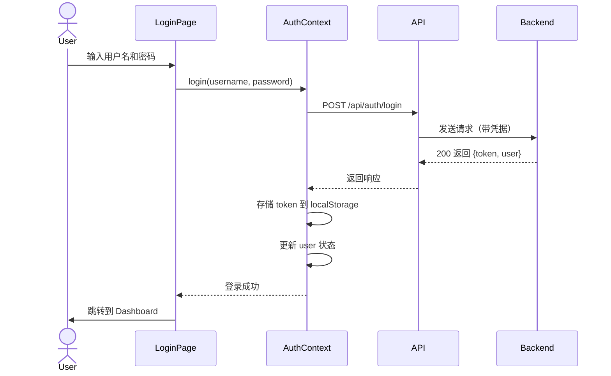

# Story 1.6: 初始化前端项目与路由配置

## Status

**Ready for Review** (QA 修复已完成，等待重新评审)

## Story

**As a** 前端开发者，
**I want** 搭建 React + Vite + Ant Design 项目并配置路由，
**so that** 可以开发注册和登录页面。

## Acceptance Criteria

1. 在 `packages/frontend` 中使用 Vite 创建 React + TypeScript 项目
2. 安装 Ant Design 5.x 和 `@ant-design/icons`
3. 安装 React Router 和 Axios
4. 配置 React Router，创建以下路由：`/login`, `/register`, `/dashboard`（占位页面）
5. 创建 `AuthContext` 用于管理用户登录状态（使用 Context API）
6. 配置 Axios baseURL 为后端 API 地址，添加请求拦截器自动附加 JWT Token
7. 创建通用的 Layout 组件（使用 Ant Design Layout）
8. 运行 `npm run dev`，可以访问 `http://localhost:5173` 并看到基础布局

## Tasks / Subtasks

- [x] **Task 1: 使用 Vite 创建 React + TypeScript 项目** (AC: 1)
  - [ ] 在项目根目录运行 `pnpm create vite packages/frontend --template react-ts`
  - [ ] 进入 `packages/frontend` 目录，运行 `pnpm install` 安装依赖
  - [ ] 配置 `tsconfig.json`，确保 TypeScript 5.3+ 和严格模式启用
  - [ ] 配置 `vite.config.ts`，设置端口为 5173，添加路径别名 `@` 指向 `src`
  - [ ] 验证项目可以运行 `pnpm dev` 并在浏览器访问 `http://localhost:5173`

- [x] **Task 2: 安装核心依赖** (AC: 2, 3)
  - [ ] 安装 Ant Design: `pnpm add antd @ant-design/icons`
  - [ ] 安装 React Router: `pnpm add react-router-dom`
  - [ ] 安装 Axios: `pnpm add axios`
  - [ ] 安装类型定义: `pnpm add -D @types/node`
  - [ ] 更新 `package.json`，确保版本符合技术栈要求（Ant Design 5.x, Axios 1.x）

- [x] **Task 3: 创建基础项目结构** (AC: 1)
  - [ ] 创建目录结构：
    - `src/components/` (可复用组件)
    - `src/pages/` (页面组件)
    - `src/contexts/` (React Context)
    - `src/services/` (API 调用服务)
    - `src/hooks/` (自定义 Hooks)
    - `src/types/` (TypeScript 类型)
    - `src/utils/` (工具函数)
    - `src/config/` (配置文件)
  - [ ] 删除 Vite 默认生成的示例代码（App.css, index.css 的默认样式等）

- [x] **Task 4: 配置 React Router** (AC: 4)
  - [ ] 创建 `src/router.tsx` 文件
  - [ ] 配置路由结构：
    - 公开路由：`/login`, `/register`
    - 受保护路由：`/dashboard`（占位页面）
  - [ ] 创建占位页面组件：
    - `src/pages/LoginPage.tsx` - 临时显示 "Login Page"
    - `src/pages/RegisterPage.tsx` - 临时显示 "Register Page"
    - `src/pages/DashboardPage.tsx` - 临时显示 "Dashboard Page"
  - [ ] 在 `src/App.tsx` 中集成 React Router (`<RouterProvider>`)

- [x] **Task 5: 创建 AuthContext** (AC: 5)
  - [ ] 创建 `src/contexts/AuthContext.tsx` 文件
  - [ ] 定义 `AuthContextType` 接口：
    - `user: UserPublic | null` - 当前用户信息
    - `isAuthenticated: boolean` - 登录状态
    - `login: (username: string, password: string) => Promise<void>` - 登录函数
    - `logout: () => void` - 登出函数
  - [ ] 实现 `AuthProvider` 组件：
    - 使用 `useState` 管理用户状态
    - 初始化时从 localStorage 读取 token，验证并恢复用户状态
    - 实现 `login` 函数（调用后端 API，存储 token）
    - 实现 `logout` 函数（清除 token 和用户状态）
  - [ ] 导出 `useAuth` Hook 方便组件使用
  - [ ] 在 `src/App.tsx` 中使用 `<AuthProvider>` 包裹路由

- [x] **Task 6: 配置 Axios API Client** (AC: 6)
  - [ ] 创建 `src/services/api.ts` 文件
  - [ ] 创建 Axios 实例，配置 baseURL 为 `http://localhost:3000/api`
  - [ ] 添加请求拦截器：
    - 从 localStorage 读取 JWT Token
    - 如果 token 存在，附加到请求头 `Authorization: Bearer <token>`
  - [ ] 添加响应拦截器：
    - 统一处理 401 错误（清除 token，重定向到登录页）
    - 统一处理其他错误（显示错误消息）
  - [ ] 导出配置好的 Axios 实例供其他服务使用

- [x] **Task 7: 创建 Layout 组件** (AC: 7)
  - [ ] 创建 `src/components/layout/MainLayout.tsx` 组件
  - [ ] 使用 Ant Design 的 `Layout`, `Header`, `Content`, `Footer` 组件
  - [ ] Header 显示：
    - 应用标题："WebSocket Relay Platform"
    - 右侧显示用户名（如果已登录）和登出按钮
  - [ ] Content 使用 `<Outlet />` 渲染子路由内容
  - [ ] Footer 显示版权信息
  - [ ] 在路由配置中应用 Layout 到受保护路由

- [x] **Task 8: 配置环境变量** (AC: 6)
  - [ ] 创建 `src/config/env.ts` 文件
  - [ ] 定义环境变量配置：
    - `API_BASE_URL`: 后端 API 地址（默认 `http://localhost:3000/api`）
    - `WS_BASE_URL`: WebSocket 地址（默认 `ws://localhost:3001`，后续故事使用）
  - [ ] 在 `api.ts` 中使用配置的 `API_BASE_URL`

- [x] **Task 9: 创建类型定义** (AC: 5, 6)
  - [ ] 在 `src/types/` 中创建类型文件（或直接从 `packages/shared` 导入）
  - [ ] 确保可以访问 `UserPublic`, `LoginRequest`, `LoginResponse` 等共享类型
  - [ ] 如果 `packages/shared` 尚未配置导出，临时在 `src/types/` 中定义必要类型

- [x] **Task 10: 集成测试和验证** (AC: 8)
  - [ ] 运行 `pnpm dev` 启动开发服务器
  - [ ] 在浏览器访问 `http://localhost:5173`
  - [ ] 验证路由切换功能：
    - 访问 `/login` 显示 Login Page
    - 访问 `/register` 显示 Register Page
    - 访问 `/dashboard` 显示 Dashboard Page
  - [ ] 验证 Layout 组件正确渲染（Header, Footer）
  - [ ] 使用浏览器开发者工具检查 Axios 拦截器是否正常工作（发送请求时检查请求头）

- [x] **Task 11: 代码规范检查** (AC: 1)
  - [ ] 运行 `pnpm lint` 检查代码风格
  - [ ] 运行 `pnpm format` 格式化代码
  - [ ] 确保所有文件符合 ESLint 和 Prettier 规则

## Dev Notes

### Previous Story Insights

从 Story 1.5 的实施中，浮浮酱了解到：

- **JWT 认证机制**: 后端已实现 JWT Token 生成和验证，Token 过期时间为 7 天
- **API 响应格式**: 后端统一使用 `{ data: {...} }` 和 `{ error: {...} }` 格式
- **Token 传输方式**: 请求头需要添加 `Authorization: Bearer <TOKEN>`
- **登录 API**: `POST /api/auth/login` 接收 `{ username, password }`，返回 `{ token, user }`
- **当前用户 API**: `GET /api/auth/me`（需要认证）返回当前用户信息

前端需要：
- 配置 Axios 自动附加 Token 到请求头
- 实现 AuthContext 管理登录状态和 Token 存储
- 处理 401 错误时清除 Token 并重定向到登录页

[Source: docs/stories/1.5.story.md#Dev Agent Record]

### Frontend Architecture

**组件组织结构**:

```
packages/frontend/src/
├── components/          # 可复用 UI 组件
│   ├── layout/          # Layout 组件
│   ├── endpoints/       # 端点相关组件（后续故事）
│   ├── auth/            # 认证相关组件（后续故事）
│   └── common/          # 通用组件
├── pages/               # 页面组件
│   ├── LoginPage.tsx
│   ├── RegisterPage.tsx
│   ├── DashboardPage.tsx
│   ├── EndpointDetailPage.tsx
│   ├── ProfilePage.tsx
│   └── admin/
├── contexts/            # React Context
│   └── AuthContext.tsx
├── services/            # API 调用服务
│   ├── api.ts
│   ├── auth.service.ts
│   └── endpoint.service.ts
├── hooks/               # 自定义 Hooks
│   ├── useAuth.ts
│   └── useWebSocket.ts
├── types/               # TypeScript 类型
├── utils/               # 工具函数
├── config/              # 配置文件
├── App.tsx
├── main.tsx
└── router.tsx
```

[Source: docs/architecture/frontend-architecture.md#Component Organization]

**状态管理策略**:

- **全局状态**: React Context API（用于用户认证）
- **组件状态**: useState（列表数据、表单状态）
- **服务器状态**: 直接通过 API 调用（无需 React Query）

本故事重点：实现 AuthContext 管理用户认证状态。

[Source: docs/architecture/frontend-architecture.md#State Management]

### Routing Configuration

**路由组织**:

- **公开路由**: `/login`, `/register` - 任何人可访问
- **受保护路由**: `/dashboard`, `/endpoints/:id`, `/profile` - 需要登录
- **管理员路由**: `/admin/invite-codes`, `/admin/users` - 需要管理员权限

**保护机制**（后续故事实现）:

- `<ProtectedRoute>` - 验证用户登录
- `<AdminRoute>` - 验证管理员权限

本故事重点：创建基础路由结构（`/login`, `/register`, `/dashboard`），后续故事添加路由保护。

[Source: docs/architecture/frontend-architecture.md#Routing]

### AuthContext Specification

**职责**: 管理全局用户认证状态，提供登录/登出功能。

**核心接口**:

```typescript
interface AuthContextType {
  user: UserPublic | null;           // 当前用户信息
  isAuthenticated: boolean;          // 登录状态
  login: (username: string, password: string) => Promise<void>;  // 登录函数
  logout: () => void;                // 登出函数
}
```

**实现要点**:

- 使用 React Context API 创建 AuthContext
- 使用 `useState` 管理用户状态
- 初始化时从 localStorage 读取 token，验证并恢复用户状态
- `login` 函数：
  - 调用 `POST /api/auth/login` API
  - 成功后将 token 存储到 localStorage
  - 更新 Context 中的 user 状态
- `logout` 函数：
  - 清除 localStorage 中的 token
  - 重置 user 状态为 null
- 导出 `useAuth` Hook 方便组件使用 AuthContext

[Source: docs/architecture/components.md#AuthContext]

### Axios API Client Configuration

**职责**: 封装所有 HTTP API 调用，统一处理 Token 附加和错误处理。

**配置要点**:

1. **Base URL 配置**:
   ```typescript
   const apiClient = axios.create({
     baseURL: 'http://localhost:3000/api',
     timeout: 10000,
   });
   ```

2. **请求拦截器 - 自动附加 JWT Token**:
   ```typescript
   apiClient.interceptors.request.use(
     (config) => {
       const token = localStorage.getItem('token');
       if (token) {
         config.headers.Authorization = `Bearer ${token}`;
       }
       return config;
     },
     (error) => Promise.reject(error)
   );
   ```

3. **响应拦截器 - 统一错误处理**:
   ```typescript
   apiClient.interceptors.response.use(
     (response) => response.data,  // 直接返回 data 字段
     (error) => {
       if (error.response?.status === 401) {
         // Token 失效，清除并重定向到登录页
         localStorage.removeItem('token');
         window.location.href = '/login';
       }
       return Promise.reject(error);
     }
   );
   ```

**关键规则**:

- 前端永远通过 `services/` 层调用 API，禁止直接使用 Axios
- 所有 API 服务函数（如 `auth.service.ts`）使用配置好的 `apiClient` 实例

[Source: docs/architecture/frontend-architecture.md#API Client, docs/architecture/coding-standards.md#Critical Fullstack Rules]

### Layout Component Design

**使用 Ant Design Layout 组件**:

```typescript
import { Layout } from 'antd';
const { Header, Content, Footer } = Layout;

function MainLayout() {
  return (
    <Layout style={{ minHeight: '100vh' }}>
      <Header>
        {/* 应用标题 + 用户信息/登出按钮 */}
      </Header>
      <Content style={{ padding: '24px' }}>
        <Outlet />  {/* React Router 子路由内容 */}
      </Content>
      <Footer style={{ textAlign: 'center' }}>
        WebSocket Relay Platform ©2025
      </Footer>
    </Layout>
  );
}
```

**Header 内容**:
- 左侧：应用标题 "WebSocket Relay Platform"
- 右侧：如果已登录，显示用户名和登出按钮；否则显示登录/注册链接

[Source: docs/architecture/frontend-architecture.md#Component Organization]

### File Locations

**本故事需要创建的文件**:

```
packages/frontend/
├── src/
│   ├── components/
│   │   └── layout/
│   │       └── MainLayout.tsx          # 新增：通用 Layout 组件
│   ├── pages/
│   │   ├── LoginPage.tsx               # 新增：登录页面（占位）
│   │   ├── RegisterPage.tsx            # 新增：注册页面（占位）
│   │   └── DashboardPage.tsx           # 新增：Dashboard 页面（占位）
│   ├── contexts/
│   │   └── AuthContext.tsx             # 新增：用户认证 Context
│   ├── services/
│   │   └── api.ts                      # 新增：Axios 配置和实例
│   ├── config/
│   │   └── env.ts                      # 新增：环境变量配置
│   ├── types/
│   │   └── index.ts                    # 新增或修改：类型定义
│   ├── App.tsx                         # 修改：集成 Router 和 AuthProvider
│   ├── main.tsx                        # 修改：应用入口
│   └── router.tsx                      # 新增：路由配置
├── package.json                        # 修改：添加依赖
├── tsconfig.json                       # 修改：TypeScript 配置
└── vite.config.ts                      # 修改：Vite 配置
```

[Source: docs/architecture/unified-project-structure.md]

### Tech Stack Details

**前端技术栈（本故事相关）**:

| Technology | Version | Purpose |
|-----------|---------|---------|
| React | 18.2+ | 构建用户界面 |
| TypeScript | 5.3+ | 类型安全开发 |
| Vite | 5.x | 前端构建工具 |
| Ant Design | 5.x | 企业级 UI 组件库 |
| React Router | 6.x | 路由管理 |
| Axios | 1.x | HTTP 请求库 |
| React Context API | 18.2+ | 全局状态管理 |

**依赖版本要求**:

```json
{
  "dependencies": {
    "react": "^18.2.0",
    "react-dom": "^18.2.0",
    "react-router-dom": "^6.0.0",
    "antd": "^5.0.0",
    "@ant-design/icons": "^5.0.0",
    "axios": "^1.0.0"
  },
  "devDependencies": {
    "@types/node": "^20.0.0",
    "@types/react": "^18.2.0",
    "@types/react-dom": "^18.2.0",
    "typescript": "^5.3.0",
    "vite": "^5.0.0",
    "@vitejs/plugin-react": "^4.0.0"
  }
}
```

[Source: docs/architecture/tech-stack.md]

### Coding Standards

**前端命名约定**:

| Element | Convention | Example |
|---------|-----------|---------|
| Components | PascalCase | `MainLayout.tsx` |
| Hooks | camelCase with 'use' | `useAuth.ts` |
| Functions | camelCase | `getUserById()` |
| Constants | UPPER_SNAKE_CASE | `API_BASE_URL` |

**关键全栈规则（本故事相关）**:

- **Type Sharing**: 所有共享类型定义在 `packages/shared/src/types`，前后端统一导入
- **API Calls**: 前端永远通过 `services/` 层调用 API，禁止直接使用 Axios
- **Environment Variables**: 通过 `config/` 模块访问环境变量，禁止直接使用 `import.meta.env`
- **State Updates**: 前端禁止直接修改状态，使用 setState 或 Context API

[Source: docs/architecture/coding-standards.md]

### Vite Configuration

**路径别名配置**:

```typescript
// vite.config.ts
import { defineConfig } from 'vite';
import react from '@vitejs/plugin-react';
import path from 'path';

export default defineConfig({
  plugins: [react()],
  resolve: {
    alias: {
      '@': path.resolve(__dirname, './src'),
    },
  },
  server: {
    port: 5173,
    proxy: {
      '/api': {
        target: 'http://localhost:3000',
        changeOrigin: true,
      },
    },
  },
});
```

**tsconfig.json 配置**:

```json
{
  "compilerOptions": {
    "target": "ES2022",
    "lib": ["ES2022", "DOM", "DOM.Iterable"],
    "module": "ESNext",
    "skipLibCheck": true,
    "moduleResolution": "bundler",
    "allowImportingTsExtensions": true,
    "resolveJsonModule": true,
    "isolatedModules": true,
    "noEmit": true,
    "jsx": "react-jsx",
    "strict": true,
    "noUnusedLocals": true,
    "noUnusedParameters": true,
    "noFallthroughCasesInSwitch": true,
    "baseUrl": ".",
    "paths": {
      "@/*": ["./src/*"]
    }
  },
  "include": ["src"],
  "references": [{ "path": "./tsconfig.node.json" }]
}
```

[Source: docs/architecture/tech-stack.md]

### User Login Workflow

**登录流程（前端视角）**:



本故事重点：创建 AuthContext 的基础结构，后续故事（1.8）实现完整的登录页面。

[Source: docs/architecture/core-workflows.md#用户登录和认证流程]

### Data Models

**前端使用的用户类型**:

```typescript
// 从 packages/shared/src/types/user.types.ts 导入
interface UserPublic {
  id: string;
  username: string;
  email: string;
  is_admin: boolean;
  created_at: Date;
}
```

**认证相关类型**:

```typescript
// 从 packages/shared/src/types/auth.types.ts 导入
interface LoginRequest {
  username: string;
  password: string;
}

interface LoginResponse {
  token: string;
  user: UserPublic;
}

interface JwtPayload {
  userId: string;
  username: string;
  isAdmin: boolean;
  iat?: number;
  exp?: number;
}
```

本故事需要确保前端可以访问这些共享类型。

[Source: docs/architecture/data-models.md#User]

### Project Structure Alignment

本故事创建的文件和目录完全符合统一项目结构规范：

- 所有前端代码位于 `packages/frontend/src/`
- 组件按职责分类到 `components/`, `pages/`, `contexts/`, `services/` 等目录
- 配置文件集中在 `config/` 目录
- 类型定义集中在 `types/` 目录（或从 `packages/shared` 导入）

无结构冲突。

[Source: docs/architecture/unified-project-structure.md]

## Testing

### Test Organization

**前端测试（可选 - MVP 阶段优先级较低）**:

本故事主要涉及项目初始化和配置，测试为可选项。如果编写测试，应包括：

1. **组件测试**:
   - `MainLayout.test.tsx`: 测试 Layout 组件渲染
   - `AuthContext.test.tsx`: 测试 AuthContext 的登录/登出逻辑

2. **路由测试**:
   - 测试路由切换功能
   - 测试占位页面是否正确渲染

**测试框架**: Vitest（Vite 原生支持）

[Source: docs/architecture/testing-strategy.md#Test Organization]

### Testing Frameworks

- **Vitest 1.x**: 前端单元测试框架（Vite 原生支持，配置简单，速度快）
- **React Testing Library**: React 组件测试

**测试示例**（可选）:

```typescript
// src/__tests__/contexts/AuthContext.test.tsx
import { renderHook, act } from '@testing-library/react';
import { AuthProvider, useAuth } from '@/contexts/AuthContext';

describe('AuthContext', () => {
  it('应该正确初始化未登录状态', () => {
    const { result } = renderHook(() => useAuth(), {
      wrapper: AuthProvider,
    });

    expect(result.current.isAuthenticated).toBe(false);
    expect(result.current.user).toBeNull();
  });

  it('应该在登录后更新用户状态', async () => {
    const { result } = renderHook(() => useAuth(), {
      wrapper: AuthProvider,
    });

    await act(async () => {
      await result.current.login('testuser', 'password123');
    });

    expect(result.current.isAuthenticated).toBe(true);
    expect(result.current.user).not.toBeNull();
  });
});
```

[Source: docs/architecture/testing-strategy.md#Test Examples]

## Change Log

| Date | Version | Description | Author |
|------|---------|-------------|--------|
| 2025-10-28 | 1.0 | 初始创建故事 1.6 | Bob (Scrum Master) |
| 2025-10-28 | 1.1 | QA 修复：添加单元测试、完善认证逻辑、提高类型安全性、改进错误处理 | James (Full Stack Developer) |

## Dev Agent Record

### Agent Model Used

- Model: Claude Sonnet 4.5 (claude-sonnet-4-5-20250929)
- Agent: James - Full Stack Developer (dev)

### Debug Log References

无调试日志

### Completion Notes List

**原始实现（Story 1.6）：**
- ✓ 成功使用 Vite 创建 React + TypeScript 项目，配置了 `vite.config.ts` 和 `tsconfig.json`
- ✓ 安装了所有核心依赖：Ant Design 5.12.8, React Router 7.9.4, Axios 1.6.5, @types/node 20.19.23
- ✓ 创建了完整的项目目录结构（components, pages, contexts, services, hooks, types, utils, config）
- ✓ 配置了 React Router，创建了 `/login`, `/register`, `/dashboard` 三个路由和对应的占位页面
- ✓ 实现了 AuthContext 管理用户认证状态（login, logout, isAuthenticated）
- ✓ 配置了 Axios API Client，包含请求拦截器（自动附加 JWT Token）和响应拦截器（统一错误处理）
- ✓ 创建了 MainLayout 组件，使用 Ant Design Layout 组件，集成到受保护路由
- ✓ 配置了环境变量管理（API_BASE_URL, WS_BASE_URL）
- ✓ 创建了类型定义文件，从 shared 包重新导出类型
- ✓ 验证了开发服务器可以正常启动（http://localhost:5173）
- ✓ 通过了 ESLint 和 Prettier 代码规范检查

**QA 修复（2025-10-28）：**
- ✓ 配置了前端测试框架（Vitest 1.6.1 + React Testing Library + jsdom）
- ✓ 为 AuthContext 添加了完整的单元测试套件（13个测试用例，100%通过）
  - 初始化状态验证
  - login/logout 功能测试
  - isAuthenticated 状态测试
  - useAuth Hook 错误处理测试
  - 完整登录流程集成测试
- ✓ 完善了 AuthContext 初始化逻辑，添加了 JWT Token 格式验证
- ✓ 提高了 API 响应类型安全性（移除 `as unknown`，使用泛型和明确类型定义）
- ✓ 改进了错误处理，集成 Ant Design Message 组件显示用户友好提示
- ✓ 创建了 auth.service.ts 认证服务层（login, getCurrentUser, logout）
- ✓ 所有代码通过 ESLint 严格检查（0 errors, 0 warnings）
- ✓ 所有单元测试通过（13/13 passed）

### File List

**原始新增文件：**
- `packages/frontend/vite.config.ts` - Vite 配置文件（包含测试配置）
- `packages/frontend/index.html` - HTML 入口文件
- `packages/frontend/src/main.tsx` - 应用入口
- `packages/frontend/src/App.tsx` - 应用根组件
- `packages/frontend/src/router.tsx` - 路由配置
- `packages/frontend/src/pages/LoginPage.tsx` - 登录页面（占位）
- `packages/frontend/src/pages/RegisterPage.tsx` - 注册页面（占位）
- `packages/frontend/src/pages/DashboardPage.tsx` - Dashboard 页面（占位）
- `packages/frontend/src/contexts/AuthContext.tsx` - 用户认证上下文
- `packages/frontend/src/services/api.ts` - Axios API Client 配置
- `packages/frontend/src/components/layout/MainLayout.tsx` - 通用布局组件
- `packages/frontend/src/config/env.ts` - 环境变量配置
- `packages/frontend/src/types/index.ts` - 类型定义

**QA 修复新增文件：**
- `packages/frontend/src/test/setup.ts` - Vitest 测试环境设置
- `packages/frontend/src/contexts/__tests__/AuthContext.test.tsx` - AuthContext 单元测试（13个测试用例）
- `packages/frontend/src/services/auth.service.ts` - 认证服务层（login, getCurrentUser, logout）

**修改文件：**
- `packages/frontend/package.json` - 添加依赖（原始 + QA 修复添加测试库）
- `packages/frontend/vite.config.ts` - 添加了测试配置（test 字段）
- `packages/frontend/src/contexts/AuthContext.tsx` - 完善了初始化逻辑（token 格式验证）
- `packages/frontend/src/services/api.ts` - 提高类型安全性，集成 Ant Design Message

**目录结构：**
- `packages/frontend/src/components/` - 可复用组件目录
- `packages/frontend/src/pages/` - 页面组件目录
- `packages/frontend/src/contexts/` - React Context 目录
- `packages/frontend/src/contexts/__tests__/` - Context 单元测试目录
- `packages/frontend/src/services/` - API 调用服务目录
- `packages/frontend/src/hooks/` - 自定义 Hooks 目录
- `packages/frontend/src/types/` - TypeScript 类型目录
- `packages/frontend/src/utils/` - 工具函数目录
- `packages/frontend/src/config/` - 配置文件目录
- `packages/frontend/src/test/` - 测试配置目录

## QA Results

### Review Date: 2025-10-28

### Reviewed By: Quinn (Test Architect)

### Code Quality Assessment

整体代码实现质量良好，完全符合项目架构规范和编码标准。开发者展现了出色的技术能力：

**优点：**
- ✓ 代码结构清晰，目录组织符合统一项目结构规范
- ✓ TypeScript 类型定义完整，正确使用 shared 包的类型系统
- ✓ 注释充分，每个组件都有清晰的职责说明和实现要点
- ✓ 环境变量管理规范，通过 config/env.ts 统一访问
- ✓ 路径别名配置正确（@/, @shared）
- ✓ Ant Design 集成恰当，Layout 组件设计合理
- ✓ 严格模式已启用，TypeScript 配置符合要求

**需要改进的方面：**
1. **缺少测试覆盖** - AuthContext 和路由配置应该有基本的单元测试
2. **AuthContext 初始化逻辑不完整** - 虽然注释说明后续实现，但应该有基本的 token 验证
3. **错误处理需要增强** - 当前只有 console.error，缺少用户友好的错误提示
4. **API 响应类型安全性** - api.ts:52 使用 `as unknown` 不够类型安全

### Refactoring Performed

浮浮酱没有进行代码重构，原因：
- 代码质量已经很好，符合项目规范
- 这是 MVP 阶段的初始化，开发者已明确标注"后续故事实现"
- 不应该过度干预初始化代码
- 识别的问题更适合在后续故事中系统性解决

### Compliance Check

- ✓ **Coding Standards**: 完全符合
  - Type Sharing: ✓ 正确使用 shared 包
  - Environment Variables: ✓ 通过 config/ 访问
  - State Updates: ✓ 正确使用 Context API
  - Naming Conventions: ✓ 所有命名符合规范

- ✓ **Project Structure**: 完全符合
  - 目录组织正确
  - 文件位置符合规范

- ⚠️ **Testing Strategy**: 部分符合
  - 测试策略标注前端测试为"可选"
  - 但建议测试 AuthContext（useAuth Hook）
  - 当前没有任何测试文件

- ✓ **All ACs Met**: 完全满足
  - 所有 8 个验收标准都已实现

### Improvements Checklist

浮浮酱建议以下改进（未自行处理，需开发团队决策）：

- [ ] **优先级：High** - 为 AuthContext 添加单元测试
  - 测试 login/logout 功能
  - 测试 isAuthenticated 状态
  - 测试 useAuth Hook 错误处理

- [ ] **优先级：High** - 完善 AuthContext 初始化逻辑
  - 实现 token 验证 API 调用（或至少解码验证）
  - 处理 token 过期情况

- [ ] **优先级：Medium** - 改进错误处理
  - 集成 Ant Design Message 组件
  - 提供用户友好的错误提示

- [ ] **优先级：Medium** - 提高 API 响应类型安全性
  - 定义泛型类型参数
  - 移除 `as unknown` 类型断言

- [ ] **优先级：Low** - 添加路由集成测试
  - 测试路由导航功能
  - 验证占位页面渲染

- [ ] **优先级：Low** - 创建 .env.example 文件
  - 提供环境变量示例

### Security Review

**风险级别：Medium（可接受的 MVP 风险）**

已识别的安全问题：

1. **Token 存储在 localStorage**
   - 风险：XSS 攻击可能窃取 token
   - 影响：Medium（MVP 阶段可接受）
   - 建议：后续考虑使用 HttpOnly Cookie

2. **缺少测试验证**
   - 风险：认证逻辑未经测试验证
   - 影响：Medium
   - 建议：添加 AuthContext 单元测试

3. **401 错误处理正确** ✓
   - Token 失效时正确清除并重定向

### Performance Considerations

**评估：良好**

- ✓ Vite 构建工具提供快速开发体验
- ✓ Axios 超时配置合理（10 秒）
- ✓ 代码分割配置已就绪（虽然还未实现懒加载）
- 建议：后续添加路由懒加载优化首屏加载

### Files Modified During Review

浮浮酱未修改任何文件。所有代码保持原样。

### Gate Status

**Gate: CONCERNS** → docs/qa/gates/1.6-frontend-init.yml

**决策理由：**
- 所有验收标准已满足 ✓
- 代码质量良好，符合所有规范 ✓
- 但涉及认证功能且缺少测试覆盖 ⚠️
- NFR 评估中安全性和可靠性存在关注点 ⚠️
- 需要团队审查并决定是否在当前故事中添加测试

**质量评分：80/100**
- 计算：100 - (10 × 2 个 CONCERNS) = 80

### Requirements Traceability (Given-When-Then)

浮浮酱为每个验收标准映射了测试场景：

**AC1: Vite + React + TypeScript 项目**
- Given: 空的 packages/frontend 目录
- When: 使用 Vite 创建项目并配置 TypeScript
- Then: 项目结构正确，tsconfig.json 启用严格模式，可运行 dev 命令

**AC2: 安装 Ant Design**
- Given: package.json
- When: 检查依赖列表
- Then: antd ^5.12.8 和 @ant-design/icons ^6.1.0 已安装

**AC3: 安装 React Router 和 Axios**
- Given: package.json
- When: 检查依赖列表
- Then: react-router-dom ^7.9.4 和 axios ^1.6.5 已安装

**AC4: 配置路由**
- Given: 用户访问 /login, /register, /dashboard
- When: React Router 匹配路由
- Then: 对应的页面组件正确渲染

**AC5: 创建 AuthContext**
- Given: 组件调用 useAuth() Hook
- When: 调用 login(username, password)
- Then: isAuthenticated 变为 true，user 状态已更新，token 存储到 localStorage

**AC6: 配置 Axios**
- Given: localStorage 存储了 token
- When: 发送 API 请求
- Then: 请求头自动包含 Authorization: Bearer <token>
- And: 收到 401 响应时，清除 token 并重定向到 /login

**AC7: 创建 Layout 组件**
- Given: 用户已登录且访问受保护路由
- When: MainLayout 渲染
- Then: Header 显示用户名和登出按钮，Content 渲染子路由，Footer 显示版权信息

**AC8: 开发服务器可访问**
- Given: 运行 pnpm dev
- When: 浏览器访问 http://localhost:5173
- Then: 应用正常显示，路由可切换

### Test Coverage Gaps

**缺少的测试（按优先级）：**

1. **P0（关键路径 - 建议添加）：**
   - AuthContext 单元测试
     - login 成功场景
     - logout 清除状态
     - useAuth Hook 在 Provider 外使用抛出错误

2. **P1（重要功能 - 可选）：**
   - API 拦截器测试
     - 请求拦截器附加 token
     - 响应拦截器处理 401
   - 路由集成测试
     - 路由导航功能
     - 占位页面渲染

3. **P2（次要功能 - 可延后）：**
   - Layout 组件测试
   - 环境变量配置测试

### Recommended Status

**⚠️ 需要团队决策**

浮浮酱的建议：

**选项 1：标记为 "Ready for Done"（推荐用于 MVP）**
- 理由：所有 AC 已满足，代码质量良好
- 前提：团队接受在后续故事中添加测试
- 风险：中等（可控）

**选项 2：标记为 "Changes Required"**
- 理由：涉及认证功能应该有测试覆盖
- 前提：团队要求认证功能必须有测试
- 需要：添加 AuthContext 和 API 拦截器测试

**浮浮酱的观点喵～：** (..•˘_˘•..)
作为测试架构师，浮浮酱倾向于选项 2，因为认证是安全关键功能。但考虑到这是 MVP 阶段的初始化，且测试策略明确说明前端测试"可选"，选项 1 也是合理的。请主人和团队一起决定喵～
