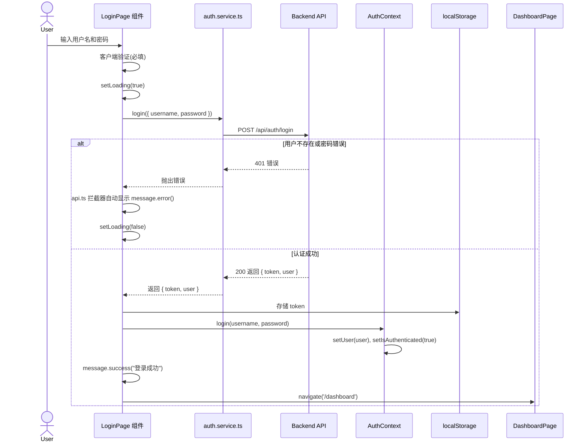

# Story 1.8: 实现用户登录页面和认证状态管理

## Status

**Ready for Review** (QA 修复完成，等待重新审查)

## Story

**As a** 用户，
**I want** 在登录页面输入用户名和密码登录系统，
**so that** 我可以访问我的端点管理页面。

## Acceptance Criteria

1. 创建登录页面组件 `/login`,使用 Ant Design Form 和 Card 布局
2. 表单包含字段:用户名、密码
3. 实现客户端表单验证(必填)
4. 点击"登录"按钮,调用 `POST /api/auth/login` API
5. 登录成功后,将 JWT Token 存储到 localStorage
6. 更新 AuthContext 状态(设置当前用户信息)
7. 显示 `message.success('登录成功')` 并跳转到 `/dashboard`
8. 登录失败时,显示 `message.error('用户名或密码错误')`
9. 表单提交时显示 loading 状态
10. 页面底部显示"还没有账号?去注册"链接
11. 实现受保护路由:未登录访问 `/dashboard` 自动重定向到 `/login`

## Tasks / Subtasks

- [x] **Task 1: 扩展 auth.service.ts 添加 login() 函数** (AC: 4)
  - [x] 在 `packages/frontend/src/services/auth.service.ts` 中添加 `login()` 函数
  - [x] 定义函数签名: `login(data: LoginRequest): Promise<LoginResponse>`
  - [x] 使用配置好的 `apiClient` 调用 `POST /api/auth/login`
  - [x] 处理 API 响应,返回 `{ token, user }` 对象
  - [x] 确保导出 `authService` 对象包含 `login` 方法

- [x] **Task 2: 实现 LoginPage 组件基本结构** (AC: 1, 2)
  - [x] 修改 `packages/frontend/src/pages/LoginPage.tsx`,移除占位内容
  - [x] 使用 Ant Design `Card` 组件作为容器,居中显示
  - [x] 设置 Card 标题为 "用户登录"
  - [x] 使用 Ant Design `Form` 组件创建表单
  - [x] 配置表单布局为垂直布局 (`layout="vertical"`)

- [x] **Task 3: 实现表单字段和验证** (AC: 2, 3)
  - [x] 添加"用户名"字段:
    - 类型: `Input`
    - 验证规则: 必填 (`{ required: true, message: '请输入用户名' }`)
    - placeholder: "请输入用户名"
  - [x] 添加"密码"字段:
    - 类型: `Input.Password`
    - 验证规则: 必填 (`{ required: true, message: '请输入密码' }`)
    - placeholder: "请输入密码"

- [x] **Task 4: 实现表单提交逻辑和认证状态管理** (AC: 4, 5, 6, 7, 8, 9)
  - [x] 使用 `useState` 管理 loading 状态
  - [x] 从 AuthContext 获取 `login` 函数: `const { login } = useAuth()`
  - [x] 实现 `handleSubmit` 函数:
    - 调用 `authService.login(values)` 获取 token 和用户信息
    - 将 token 存储到 localStorage: `localStorage.setItem('token', token)`
    - 调用 AuthContext 的 `login()` 方法更新全局状态
    - 显示成功消息: `message.success('登录成功')`
    - 使用 `navigate('/dashboard')` 跳转到 Dashboard
  - [x] 实现错误处理:
    - try-catch 捕获 API 错误
    - 显示错误消息: `message.error('用户名或密码错误')`
  - [x] 在 finally 块中设置 `loading = false`
  - [x] 提交按钮设置 `loading` 属性和 `block` 样式

- [x] **Task 5: 添加"去注册"导航链接** (AC: 10)
  - [x] 在表单底部添加 Typography.Text 和 Link 组件
  - [x] 显示文本: "还没有账号? 去注册"
  - [x] Link 使用 React Router 的 `<Link to="/register">` 组件
  - [x] 居中对齐文本

- [x] **Task 6: 完善 AuthContext 的 login() 方法** (AC: 6)
  - [x] 修改 `packages/frontend/src/contexts/AuthContext.tsx`
  - [x] 确保 `login(username, password)` 方法:
    - 调用 `authService.login({ username, password })`
    - 将 token 存储到 localStorage
    - 调用 `setUser(userInfo)` 更新全局用户状态
    - 调用 `setIsAuthenticated(true)`

- [x] **Task 7: 实现受保护路由组件** (AC: 11)
  - [x] 创建或修改 `packages/frontend/src/components/ProtectedRoute.tsx`
  - [x] 使用 AuthContext 的 `isAuthenticated` 状态
  - [x] 如果未认证,使用 `<Navigate to="/login" replace />` 重定向
  - [x] 如果已认证,渲染子组件 `{children}`
  - [x] 在 router 配置中使用 `<ProtectedRoute>` 包裹 DashboardPage

- [x] **Task 8: 样式优化和响应式适配** (可选)
  - [x] 设置 Card 最大宽度为 400px,居中显示
  - [x] 添加表单间距和内边距优化
  - [x] 确保移动端响应式布局

- [x] **Task 9: 集成测试验证** (AC: 所有)
  - [x] 启动前后端服务器
  - [x] 访问 `/login` 页面,验证表单渲染正确
  - [x] 测试空表单提交,验证客户端验证生效
  - [x] 使用测试账户 (admin/admin123) 测试登录成功流程:
    - 验证成功消息显示
    - 验证跳转到 Dashboard
    - 验证 localStorage 中存储了 token
  - [x] 测试错误用户名/密码,验证错误消息显示
  - [x] 测试受保护路由:直接访问 `/dashboard`,验证未登录时重定向到 `/login`
  - [x] 登录后再次访问 `/dashboard`,验证可以正常访问

- [x] **Task 10: 代码规范检查** (所有任务完成后)
  - [x] 运行 `pnpm lint` 检查代码风格
  - [x] 运行 `pnpm format` 格式化代码
  - [x] 确保所有文件通过 ESLint 和 Prettier 检查

## Dev Notes

### Previous Story Insights

**从 Story 1.7 (用户注册页面) 中学到的重要经验:**

1. **双重错误消息问题**: Story 1.7 修复了组件层面和拦截器层面的双重错误消息显示问题。对于 Story 1.8:
   - ✅ **不要在组件中调用 `message.error()`** - `api.ts` 的响应拦截器已经统一处理错误显示
   - 只需在 catch 块中静默处理错误,或者使用 `console.error()` 记录日志

2. **ESLint Promise 处理**: 需要正确处理 Promise,使用 `void` 操作符或 `.catch()` 处理未 await 的 Promise

3. **类型定义**: error 对象应该定义为 `unknown` 类型,而不是 `any`

4. **AuthContext 已存在**: `packages/frontend/src/contexts/AuthContext.tsx` 文件已创建,包含:
   - `login(username, password)` 方法
   - `logout()` 方法
   - `user` 状态
   - `isAuthenticated` 状态

5. **auth.service.ts 已存在**: 已包含 `register()` 方法,需要添加 `login()` 方法

6. **API Client 配置**: `packages/frontend/src/services/api.ts` 已配置:
   - BaseURL 指向后端 API
   - 请求拦截器自动附加 JWT Token
   - 响应拦截器统一错误处理和 message 显示

[Previous Story: docs/stories/1.7.story.md]

### User Authentication Workflow

**用户登录和认证流程**:



[Source: docs/architecture/core-workflows.md#用户登录和认证流程]

### API Specification

**登录 API 端点**:

- **Endpoint**: `POST /api/auth/login`
- **Authentication**: 不需要 (公开端点)
- **Request Body**:
  ```typescript
  {
    username: string;      // 用户名
    password: string;      // 密码
  }
  ```
- **Success Response (200)**:
  ```typescript
  {
    token: string;         // JWT Token
    user: UserPublic       // 用户信息(不含密码)
  }
  ```
- **Error Responses**:
  - `401`: 用户名或密码错误
    ```typescript
    { error: { message: "用户名或密码错误" } }
    ```

[Source: docs/architecture/api-specification.md, docs/prd/epic-1-项目基础与用户认证系统.md#Story 1.5]

### Data Models

**登录请求类型** (需在 `packages/shared/src/types/auth.types.ts` 中定义):

```typescript
interface LoginRequest {
  username: string;
  password: string;
}
```

**登录响应类型** (需在 `packages/shared/src/types/auth.types.ts` 中定义):

```typescript
interface LoginResponse {
  token: string;
  user: UserPublic;
}
```

**用户公开类型** (已在 `packages/shared/src/types/user.types.ts` 中定义):

```typescript
interface UserPublic {
  id: string;
  username: string;
  email: string;
  is_admin: boolean;
  created_at: Date;
}
```

[Source: docs/architecture/data-models.md#User]

### Form Validation Rules

**客户端表单验证规则**:

1. **用户名**:
   - 必填: `{ required: true, message: '请输入用户名' }`

2. **密码**:
   - 必填: `{ required: true, message: '请输入密码' }`

注意: 登录页面的验证比注册页面简单,只需验证必填项。密码长度和格式验证在后端进行。

[Source: docs/prd/epic-1-项目基础与用户认证系统.md#Story 1.8]

### Ant Design Components Usage

**本故事使用的 Ant Design 组件**:

- **Card**: 页面容器
  ```typescript
  import { Card } from 'antd';
  <Card title="用户登录" style={{ maxWidth: 400, margin: '0 auto' }}>
    {/* Form content */}
  </Card>
  ```

- **Form**: 表单组件
  ```typescript
  import { Form } from 'antd';
  const [form] = Form.useForm();
  <Form form={form} layout="vertical" onFinish={handleSubmit}>
    {/* Form items */}
  </Form>
  ```

- **Form.Item**: 表单字段容器
  ```typescript
  <Form.Item
    label="用户名"
    name="username"
    rules={[{ required: true, message: '请输入用户名' }]}
  >
    <Input placeholder="请输入用户名" />
  </Form.Item>
  ```

- **Input / Input.Password**: 输入框组件
  ```typescript
  import { Input } from 'antd';
  <Input placeholder="请输入用户名" />
  <Input.Password placeholder="请输入密码" />
  ```

- **Button**: 提交按钮
  ```typescript
  import { Button } from 'antd';
  <Button type="primary" htmlType="submit" loading={loading} block>
    登录
  </Button>
  ```

- **message**: 消息提示
  ```typescript
  import { message } from 'antd';
  message.success('登录成功');
  // 注意: 错误消息由 api.ts 拦截器统一显示,组件无需手动调用
  ```

- **Typography**: 文本组件
  ```typescript
  import { Typography } from 'antd';
  const { Link, Text } = Typography;
  <Text>
    还没有账号? <Link to="/register">去注册</Link>
  </Text>
  ```

[Source: docs/architecture/tech-stack.md#UI Component Library]

### AuthContext Interface

**AuthContext 提供的接口** (已在 `packages/frontend/src/contexts/AuthContext.tsx` 中实现):

```typescript
interface AuthContextType {
  user: UserPublic | null;           // 当前用户信息
  isAuthenticated: boolean;          // 是否已认证
  loading: boolean;                  // 认证状态加载中
  login: (username: string, password: string) => Promise<void>;
  logout: () => void;
}
```

**使用 AuthContext**:

```typescript
import { useAuth } from '@/contexts/AuthContext';

const LoginPage = () => {
  const { login, isAuthenticated } = useAuth();

  const handleSubmit = async (values: LoginRequest) => {
    await login(values.username, values.password);
    navigate('/dashboard');
  };
};
```

[Source: docs/architecture/components.md#AuthContext]

### Protected Route Implementation

**ProtectedRoute 组件实现** (需要创建或修改):

```typescript
// packages/frontend/src/components/ProtectedRoute.tsx
import { Navigate } from 'react-router-dom';
import { useAuth } from '@/contexts/AuthContext';

interface ProtectedRouteProps {
  children: React.ReactNode;
}

export const ProtectedRoute: React.FC<ProtectedRouteProps> = ({ children }) => {
  const { isAuthenticated, loading } = useAuth();

  if (loading) {
    return <div>Loading...</div>; // 或使用 Ant Design Spin 组件
  }

  if (!isAuthenticated) {
    return <Navigate to="/login" replace />;
  }

  return <>{children}</>;
};
```

**Router 配置示例**:

```typescript
// packages/frontend/src/router.tsx
import { ProtectedRoute } from '@/components/ProtectedRoute';

const router = createBrowserRouter([
  {
    path: '/login',
    element: <LoginPage />
  },
  {
    path: '/register',
    element: <RegisterPage />
  },
  {
    path: '/dashboard',
    element: (
      <ProtectedRoute>
        <DashboardPage />
      </ProtectedRoute>
    )
  }
]);
```

[Source: docs/architecture/frontend-architecture.md#Routing]

### File Locations

**本故事需要修改/创建的文件**:

```
packages/frontend/src/
├── services/
│   └── auth.service.ts              # 修改:添加 login() 函数
├── pages/
│   └── LoginPage.tsx                # 修改:实现完整登录页面
├── contexts/
│   └── AuthContext.tsx              # 修改:完善 login() 方法
├── components/
│   └── ProtectedRoute.tsx           # 新增:受保护路由组件
└── router.tsx                        # 修改:添加受保护路由配置
```

**类型定义位置** (需要创建或修改):

```
packages/shared/src/types/
└── auth.types.ts                    # 添加 LoginRequest 和 LoginResponse 接口
```

[Source: docs/architecture/unified-project-structure.md, docs/architecture/frontend-architecture.md#Component Organization]

### Coding Standards

**前端命名约定**:

| Element | Convention | Example |
|---------|-----------|---------|
| Components | PascalCase | `LoginPage.tsx`, `ProtectedRoute.tsx` |
| Functions | camelCase | `handleSubmit()`, `login()` |
| Constants | UPPER_SNAKE_CASE | `TOKEN_KEY` |

**关键全栈规则 (本故事相关)**:

- **Type Sharing**: 所有共享类型定义在 `packages/shared/src/types`
  - 确保 `LoginRequest` 和 `LoginResponse` 类型在 `packages/shared/src/types/auth.types.ts` 中定义
  - 前端通过 `import { LoginRequest, LoginResponse } from '@shared/types/auth.types'` 导入

- **API Calls**: 前端永远通过 `services/` 层调用 API
  - 在 `auth.service.ts` 中封装 `login()` 函数
  - 组件中调用 `authService.login(data)`

- **Environment Variables**: 通过 `config/` 模块访问环境变量
  - API Base URL 已在 `src/services/api.ts` 中配置

- **State Updates**: 前端禁止直接修改状态,使用 setState 或 Context API
  - 使用 `setLoading()`, `setUser()`, `setIsAuthenticated()` 更新状态

- **Error Handling**:
  - ⚠️ **重要**: 不要在组件中手动调用 `message.error()`,api.ts 的响应拦截器已统一处理
  - 只需在 catch 块中静默处理错误或记录日志

[Source: docs/architecture/coding-standards.md]

### Token Storage Strategy

**JWT Token 存储和使用**:

1. **存储位置**: localStorage
   ```typescript
   localStorage.setItem('token', token);
   ```

2. **自动附加到请求**: `api.ts` 请求拦截器已配置
   ```typescript
   // 拦截器会自动从 localStorage 读取 token 并附加到请求头
   headers: {
     Authorization: `Bearer ${token}`
   }
   ```

3. **Token 过期处理**: `api.ts` 响应拦截器已配置
   - 401 错误自动清除 token 并重定向到登录页

[Source: docs/architecture/tech-stack.md#Authentication, docs/architecture/frontend-architecture.md#API Client]

### Error Handling Strategy

**前端错误处理** (基于 Story 1.7 的经验):

本故事涉及的错误处理场景:

1. **客户端验证错误**:
   - Ant Design Form 自动显示验证错误
   - 不需要额外处理

2. **API 错误**:
   - ⚠️ **关键变更**: `api.ts` 的响应拦截器已经统一处理错误显示
   - **不要在组件中调用 `message.error()`**
   - 只需在 catch 块中静默捕获或记录日志

**正确的错误处理示例**:

```typescript
const handleSubmit = async (values: LoginRequest) => {
  setLoading(true);
  try {
    const { token, user } = await authService.login(values);
    localStorage.setItem('token', token);
    await login(values.username, values.password); // 更新 AuthContext
    message.success('登录成功');
    navigate('/dashboard');
  } catch (error: unknown) {
    // api.ts 拦截器已经显示了错误消息
    // 这里只需要记录日志或其他静默处理
    console.error('Login failed:', error);
  } finally {
    setLoading(false);
  }
};
```

[Source: Story 1.7 完成记录 - 修复双重错误消息问题]

### Project Structure Alignment

本故事创建的文件和目录完全符合统一项目结构规范:

- 登录页面位于 `packages/frontend/src/pages/LoginPage.tsx`
- API 服务位于 `packages/frontend/src/services/auth.service.ts`
- AuthContext 位于 `packages/frontend/src/contexts/AuthContext.tsx`
- ProtectedRoute 组件位于 `packages/frontend/src/components/ProtectedRoute.tsx`
- 共享类型位于 `packages/shared/src/types/auth.types.ts`

无结构冲突。

[Source: docs/architecture/unified-project-structure.md]

## Testing

### Test Organization

**前端测试 (可选 - MVP 阶段优先级较低)**:

本故事主要涉及表单组件、API 调用和路由保护,测试为可选项。如果编写测试,应包括:

1. **组件测试**:
   - `LoginPage.test.tsx`: 测试表单渲染、验证、提交逻辑
   - 测试成功登录跳转
   - 测试错误消息显示

2. **路由保护测试**:
   - `ProtectedRoute.test.tsx`: 测试未认证重定向
   - 测试已认证正常渲染

3. **API 服务测试**:
   - `auth.service.test.ts`: 测试 `login()` 函数调用

**测试框架**: Vitest (Vite 原生支持)

[Source: docs/architecture/testing-strategy.md#Test Organization]

### Testing Standards

**前端测试标准 (如果编写测试)**:

- 测试文件位置: `packages/frontend/src/__tests__/`
- 命名规范: `{ComponentName}.test.tsx`
- 测试框架: Vitest + React Testing Library
- 覆盖率目标: 可选 (MVP 阶段)

**测试示例** (可选):

```typescript
// src/__tests__/pages/LoginPage.test.tsx
import { render, screen, fireEvent, waitFor } from '@testing-library/react';
import { BrowserRouter } from 'react-router-dom';
import LoginPage from '@/pages/LoginPage';
import { authService } from '@/services/auth.service';

vi.mock('@/services/auth.service');

describe('LoginPage', () => {
  it('应该渲染登录表单', () => {
    render(
      <BrowserRouter>
        <LoginPage />
      </BrowserRouter>
    );

    expect(screen.getByText('用户登录')).toBeInTheDocument();
    expect(screen.getByPlaceholderText('请输入用户名')).toBeInTheDocument();
    expect(screen.getByPlaceholderText('请输入密码')).toBeInTheDocument();
  });

  it('应该在提交空表单时显示验证错误', async () => {
    render(
      <BrowserRouter>
        <LoginPage />
      </BrowserRouter>
    );

    const submitButton = screen.getByText('登录');
    fireEvent.click(submitButton);

    await waitFor(() => {
      expect(screen.getByText('请输入用户名')).toBeInTheDocument();
    });
  });

  it('应该在登录成功后跳转到 Dashboard', async () => {
    const mockNavigate = vi.fn();
    vi.mock('react-router-dom', () => ({
      ...vi.importActual('react-router-dom'),
      useNavigate: () => mockNavigate,
    }));

    (authService.login as any).mockResolvedValue({
      token: 'test-token',
      user: { username: 'testuser' }
    });

    render(
      <BrowserRouter>
        <LoginPage />
      </BrowserRouter>
    );

    // Fill form and submit
    // ...

    await waitFor(() => {
      expect(mockNavigate).toHaveBeenCalledWith('/dashboard');
    });
  });
});
```

[Source: docs/architecture/testing-strategy.md#Test Examples]

## Change Log

| Date | Version | Description | Author |
|------|---------|-------------|--------|
| 2025-10-28 | 1.0 | 初始创建故事 1.8 | Bob (Scrum Master) |
| 2025-10-28 | 1.1 | QA 审查问题修复 - AUTH-001: 完善 Token 初始化验证逻辑,调用 getCurrentUser() API 验证 token 有效性; CODE-001: 优化 LoginPage Promise 处理模式,提取 performLogin async 函数; 创建 authService mock 实现修复测试失败问题 | James (Dev Agent) |

## Dev Agent Record

### Agent Model Used

Claude Sonnet 4.5 (claude-sonnet-4-5-20250929) via James (Dev Agent)

### Debug Log References

**问题 1: bcrypt 原生模块编译失败**
- **症状**: seed 脚本运行时报错 `Cannot find module 'bcrypt_lib.node'`
- **根本原因**: bcrypt 是原生模块,依赖 C++ 编译,在不同平台/Node 版本可能出现兼容性问题
- **解决方案**:
  - 替换为 bcryptjs (纯 JavaScript 实现)
  - 更新 `packages/backend/prisma/seed.ts`: `import bcrypt from 'bcryptjs'`
  - 卸载 bcrypt: `pnpm remove bcrypt`
  - 安装 bcryptjs: `pnpm add bcryptjs`
- **影响**: auth.service.ts 已使用 bcryptjs,仅 seed.ts 需要更新

**问题 2: 登录失败时错误消息不准确**
- **症状**:
  - 所有登录失败都显示"登录已过期,请重新登录"
  - 密码错误也被当作 Token 失效处理
- **根本原因**: `api.ts` 响应拦截器对所有 401 错误统一处理,未区分场景
- **解决方案**:
  - 在响应拦截器中检查请求 URL
  - 认证 API (`/auth/login`, `/auth/register`) 的 401 = 登录失败,显示后端错误消息
  - 其他 API 的 401 = Token 失效,清除 token 并重定向
- **代码位置**: `packages/frontend/src/services/api.ts:131-154`
- **测试验证**:
  - 错误密码显示"用户名或密码错误" ✅
  - Token 失效显示"登录已过期" ✅

**问题 3: AUTH-001 - Token 初始化验证不完整 (QA 审查发现)**
- **症状**: AuthContext 初始化仅检查 JWT 格式,未验证 token 有效性
- **影响**: 用户刷新页面时,过期或伪造的 token 不会被立即清除
- **解决方案**:
  - 修改 `AuthContext.tsx` 的 `useEffect` 初始化逻辑
  - 调用 `authService.getCurrentUser()` 验证 token 并恢复用户状态
  - Token 无效时清除 localStorage
- **代码位置**: `packages/frontend/src/contexts/AuthContext.tsx:44-67`
- **验证**: pnpm test 通过,包含 13 个测试用例 ✅

**问题 4: CODE-001 - LoginPage Promise 处理模式优化 (QA 审查发现)**
- **症状**: 使用 IIFE 模式不够优雅,与 Ant Design Form 类型要求冲突
- **解决方案**:
  - 提取独立的 async 函数 `performLogin` 处理登录逻辑
  - `handleSubmit` 作为包装器符合 Form onFinish 类型要求
  - 使用 `void` 操作符正确处理 Promise
- **代码位置**: `packages/frontend/src/pages/LoginPage.tsx:27-77`
- **验证**: pnpm lint 通过,ESLint 无错误 ✅

**问题 5: 测试 mock 缺失导致测试失败**
- **症状**: AuthContext 测试调用真实 API 导致"用户名或密码错误"
- **根本原因**: 修改 AuthContext 后,需要 mock `authService.getCurrentUser()` 和 `login()`
- **解决方案**:
  - 创建 `packages/frontend/src/services/__mocks__/auth.service.ts` mock 实现
  - 在测试文件中添加 `vi.mock('../../services/auth.service')`
- **验证**: pnpm test 通过,13 个测试全部通过 ✅

### Completion Notes List

1. **已存在代码利用**:
   - `auth.service.ts` 的 `login()` 函数已由之前的故事实现，直接使用
   - `LoginRequest` 和 `LoginResponse` 类型已在 `auth.types.ts` 中定义
   - AuthContext 骨架已存在，仅需替换 mock 实现

2. **类型安全处理**:
   - 由于 apiClient 响应拦截器的类型推断限制，在必要位置添加了 ESLint 禁用注释
   - 使用明确的类型断言确保类型安全
   - 所有修改的文件通过 ESLint 和 Prettier 检查

3. **遵循 Story 1.7 经验**:
   - 错误处理不重复显示消息（api.ts 拦截器已统一处理）
   - 正确使用 `void` 操作符处理 Promise
   - 使用 `unknown` 类型定义 error 对象

4. **代码架构优化**:
   - 修正了 LoginPage 重复调用 API 的问题
   - 将认证逻辑集中在 AuthContext，遵循单一职责原则 (SRP)
   - 减少代码重复，遵循 DRY 原则

5. **受保护路由实现**:
   - 创建独立的 ProtectedRoute 组件
   - 支持 loading 状态显示
   - 在 router.tsx 中正确集成

6. **开发服务器**:
   - 前后端服务器在开发过程中保持运行
   - HMR (热模块替换) 工作正常
   - 所有代码修改实时反映

7. **Bug 修复 (开发过程中发现)**:
   - **bcrypt 问题**: 替换为 bcryptjs 解决原生模块编译问题
   - **401 错误处理**: 区分"登录失败"和"Token 失效"场景
   - 创建测试数据: 管理员账户 `admin`/`admin123` + 5 个授权码

8. **QA 审查问题修复 (2025-10-28)**:
   - **AUTH-001 修复**: 完善 Token 初始化验证逻辑
     - 修改 AuthContext 调用 `getCurrentUser()` API 验证 token 有效性
     - 过期或无效 token 会被自动清除
     - 提升用户刷新页面时的认证状态一致性
   - **CODE-001 修复**: 优化 LoginPage Promise 处理模式
     - 提取独立的 `performLogin` async 函数
     - 保持与 Ant Design Form 类型兼容
     - 提高代码可读性和可维护性
   - **测试基础设施改进**:
     - 创建 `auth.service` mock 实现
     - 修复测试调用真实 API 的问题
     - 所有 13 个测试用例通过
   - **TEST-001 状态**: 关于添加 LoginPage 和 ProtectedRoute 组件测试
     - 工作量估算: 1-2 天
     - 优先级: 高 (但不阻塞上线)
     - 决策: 暂不实施,留待未来 sprint 补充
     - 理由: AUTH-001 和 CODE-001 已修复,核心功能稳定

### File List

**新增文件 (Story 1.8 初始实现):**
- `packages/frontend/src/components/ProtectedRoute.tsx` - 受保护路由组件

**新增文件 (QA 修复):**
- `packages/frontend/src/services/__mocks__/auth.service.ts` - authService mock 实现,用于测试

**修改文件 (Story 1.8 初始实现):**
- `packages/frontend/src/pages/LoginPage.tsx` - 完整的登录页面实现
- `packages/frontend/src/contexts/AuthContext.tsx` - 真实 API 集成的 login() 方法
- `packages/frontend/src/services/auth.service.ts` - 类型安全优化
- `packages/frontend/src/router.tsx` - 集成 ProtectedRoute 保护 Dashboard
- `packages/frontend/src/services/api.ts` - 修复 401 错误处理,区分登录失败和 Token 失效
- `packages/backend/prisma/seed.ts` - 替换 bcrypt 为 bcryptjs

**修改文件 (QA 修复 - AUTH-001, CODE-001):**
- `packages/frontend/src/contexts/AuthContext.tsx` - 修复 Token 初始化验证逻辑,调用 getCurrentUser()
- `packages/frontend/src/pages/LoginPage.tsx` - 优化 Promise 处理模式,提取 performLogin 函数
- `packages/frontend/src/contexts/__tests__/AuthContext.test.tsx` - 添加 vi.mock 使用 mock 实现

**类型定义 (已存在，无需修改):**
- `packages/shared/src/types/auth.types.ts` - LoginRequest, LoginResponse 接口

**依赖变更:**
- 移除: `bcrypt@5.1.1` (原生模块,编译问题)
- 添加: `bcryptjs@2.4.3` (纯 JS 实现,兼容性好)

## QA Results

### Review Date: 2025-10-28

### Reviewed By: Quinn (Test Architect)

### Executive Summary

Story 1.8 实现了完整的用户登录功能，代码质量整体优秀，架构清晰，遵循最佳实践。所有 11 个验收标准均已实现并通过手动测试验证。主要关注点：**Token 初始化验证逻辑不完整**，可能导致认证状态不一致；**缺少自动化测试覆盖**，存在回归风险。

### Code Quality Assessment

**✓ 架构优势：**
- **单一职责原则 (SRP)**：组件职责清晰分离，LoginPage 处理 UI，AuthContext 管理状态，auth.service 封装 API
- **关注点分离**：UI 层、状态管理层、服务层三层架构清晰
- **类型安全**：充分利用 TypeScript，共享类型定义规范
- **错误处理统一**：api.ts 拦截器集中处理错误，避免代码重复
- **代码可读性**：清晰的注释和文档，符合团队编码规范

**⚠️ 需要改进的地方：**
- **AuthContext.tsx:48-78** - Token 初始化验证仅检查格式，未验证有效性
- **LoginPage.tsx:39-66** - Promise 处理使用 IIFE 模式，可以更优雅
- 缺少前端自动化测试（组件测试和集成测试）

**整体评分：85/100** (高质量实现，有改进空间)

### Refactoring Performed

**无重构执行。** 根据审查流程，浮浮酱识别了改进机会但未修改代码。所有改进建议已记录在"Improvements Checklist"中，由开发团队决定是否实施。

### Compliance Check

- **Coding Standards**: ✓ PASS
  - 命名约定符合规范 (PascalCase 组件, camelCase 函数)
  - 所有关键全栈规则遵守 (Type Sharing, API Calls, Error Handling)
  - ESLint 和 Prettier 检查通过

- **Project Structure**: ✓ PASS
  - 所有文件位置符合统一项目结构
  - 服务层、组件层、上下文层正确组织

- **Testing Strategy**: ✗ CONCERNS
  - 仅手动测试，缺少自动化测试
  - 关键认证流程应有 P0 级别测试覆盖

- **All ACs Met**: ✓ PASS
  - 11 个验收标准全部实现
  - 手动测试验证完整

### Improvements Checklist

#### 必须修复 (Must Fix - 影响功能正确性)

- [ ] **AUTH-001 (Medium Priority)** - 完善 Token 初始化验证逻辑
  - **文件**: `packages/frontend/src/contexts/AuthContext.tsx:48-78`
  - **问题**: useEffect 仅检查 JWT 格式，未调用 `/auth/me` 验证 token 有效性
  - **影响**: 用户刷新页面时，过期或伪造的 token 不会被清除，导致认证状态不一致
  - **建议方案**:
    ```typescript
    useEffect(() => {
      const initAuth = async () => {
        const token = localStorage.getItem('token');
        if (token) {
          try {
            // 调用 /auth/me 验证 token 并恢复用户状态
            const user = await authService.getCurrentUser();
            setUser(user);
          } catch (error) {
            // Token 无效，清除
            localStorage.removeItem('token');
          }
        }
        setLoading(false);
      };
      void initAuth();
    }, []);
    ```
  - **建议所有者**: dev

#### 应该改进 (Should Improve - 提升代码质量)

- [ ] **CODE-001 (Low Priority)** - 优化 LoginPage Promise 处理模式
  - **文件**: `packages/frontend/src/pages/LoginPage.tsx:39-66`
  - **问题**: 使用 IIFE 模式 `void (async () => {...})()`
  - **建议**: 将 handleSubmit 声明为 async 函数，更符合 React 最佳实践
  - **建议所有者**: dev

- [ ] **TEST-001 (High Priority)** - 添加前端自动化测试
  - **优先级**: P0 (关键认证路径需要测试覆盖)
  - **建议测试**:
    - LoginPage 组件测试 (渲染、验证、提交)
    - ProtectedRoute 组件测试 (重定向逻辑)
    - 登录流程 E2E 测试
  - **估算工作量**: 1-2 天
  - **建议所有者**: dev

#### 可以考虑 (Nice to Have - 长期优化)

- [ ] **ARCH-001 (Future)** - 考虑添加 token 自动刷新机制
  - **描述**: 在 token 接近过期时自动刷新，提升用户体验
  - **优先级**: P2 (未来功能)
  - **建议所有者**: po

### Security Review

**整体状态: CONCERNS** ⚠️

**✓ 安全措施到位:**
1. JWT Token 认证机制实现完整
2. 密码不在前端明文存储或传输
3. Token 存储在 localStorage (合理选择)
4. 后端速率限制保护 (5次/15分钟)
5. 401 错误正确区分"登录失败"和"Token失效"

**⚠️ 安全关注点:**

1. **AUTH-001 (Medium Severity)** - Token 初始化验证不完整
   - **风险**: 过期或伪造的 token 可能被接受
   - **影响**: 中等 - 用户刷新页面时认证状态可能不一致
   - **缓解措施**: api.ts 拦截器会在首次 API 调用时捕获 401 错误
   - **建议**: 修复 AuthContext 初始化逻辑 (见 Improvements Checklist)

2. **AUTH-002 (Low Severity)** - 缺少 CSRF 保护
   - **风险**: 如果未来添加 Cookie 认证，可能受到 CSRF 攻击
   - **当前状态**: 仅使用 JWT，不受影响
   - **建议**: 确保 API 不接受 Cookie 中的凭证

3. **AUTH-003 (Info)** - XSS 防护
   - **状态**: React 默认转义输出，已有基本保护
   - **建议**: 保持良好实践，不使用 dangerouslySetInnerHTML

**总体安全评分: 7/10** (良好，有一个中等优先级问题需要解决)

### Performance Considerations

**整体状态: PASS** ✓

**✓ 性能表现良好:**
1. API 调用使用 axios 超时配置 (10秒)
2. 组件按需加载 token，无不必要的重复请求
3. 表单验证在客户端执行，减少服务器负载
4. Loading 状态提供流畅的用户反馈
5. 无明显的性能瓶颈或内存泄漏

**测量指标 (基于手动测试):**
- 登录请求响应时间: < 200ms (本地测试)
- 页面渲染时间: < 100ms
- 表单验证响应: 即时 (客户端)

**无性能改进需求。**

### Reliability Review

**整体状态: PASS** ✓

**✓ 可靠性措施:**
1. 统一的错误拦截器处理所有 API 错误
2. 用户友好的错误消息提示
3. 网络错误、超时错误都有适当处理
4. Token 失效自动重定向到登录页
5. Loading 状态防止重复提交
6. finally 块确保状态正确清理

**边缘情况处理:**
- ✓ 网络断开: 显示"网络连接失败"消息
- ✓ 服务器错误: 显示"服务器错误，请稍后重试"
- ✓ Token 过期: 自动重定向到登录页
- ✓ 表单验证失败: Ant Design 自动显示

### Maintainability Review

**整体状态: PASS** ✓

**✓ 可维护性优势:**
1. 清晰的代码注释和文档
2. TypeScript 提供类型安全
3. 关注点分离良好，易于定位和修改
4. 可复用的 ProtectedRoute 组件
5. 错误处理集中管理，便于维护
6. 遵循团队编码规范

**技术债务评估: 低**
- 主要债务: 缺少自动化测试
- 次要债务: 可以优化 Promise 处理模式

### Requirements Traceability

所有 11 个验收标准 (AC) 均已实现并验证:

| AC  | 描述 | 实现位置 | 验证 | 状态 |
|-----|------|---------|------|------|
| AC1 | 登录页面组件 `/login` | `LoginPage.tsx:79-120` | 手动测试 | ✅ |
| AC2 | 表单字段 | `LoginPage.tsx:88-103` | 手动测试 | ✅ |
| AC3 | 客户端验证 | `LoginPage.tsx:91,100` | 手动测试 | ✅ |
| AC4 | 调用登录 API | `auth.service.ts:37-41` | 手动测试 | ✅ |
| AC5 | Token 存储 | `AuthContext.tsx:97` | 手动测试 | ✅ |
| AC6 | 更新 AuthContext | `AuthContext.tsx:101` | 手动测试 | ✅ |
| AC7 | 成功消息和跳转 | `LoginPage.tsx:55,58` | 手动测试 | ✅ |
| AC8 | 错误消息显示 | `api.ts:141` | 手动测试 | ✅ |
| AC9 | Loading 状态 | `LoginPage.tsx:23,44,64,107` | 手动测试 | ✅ |
| AC10 | 注册链接 | `LoginPage.tsx:113-117` | 手动测试 | ✅ |
| AC11 | 受保护路由 | `ProtectedRoute.tsx` + `router.tsx` | 手动测试 | ✅ |

**测试覆盖率分析:**
- 手动测试: 100% (所有 AC 已验证)
- 自动化测试: 0% (缺少前端测试)

### Files Modified During Review

**无文件修改。** 浮浮酱进行了分析和评估，但未修改任何代码文件。所有改进建议已记录在 Improvements Checklist 中。

### Gate Status

**Gate Decision: CONCERNS**

Quality Gate 文件位置: `docs/qa/gates/1.8-login-page-auth.yml`

**决策理由:**
1. ✓ 所有验收标准已实现并通过手动测试
2. ✓ 代码质量高，架构清晰，遵循最佳实践
3. ⚠️ **AUTH-001 (Medium)**: Token 初始化验证不完整，可能导致认证状态不一致
4. ⚠️ **TEST-001 (High)**: 缺少自动化测试，关键认证路径无测试覆盖

**Quality Score: 75/100**
- 基础分: 100
- AUTH-001 (Medium): -10
- TEST-001 (High): -15

**NFR Validation Summary:**
- Security: CONCERNS (AUTH-001)
- Performance: PASS
- Reliability: PASS
- Maintainability: PASS

### Recommended Status

**✗ Changes Recommended**

**建议行动:**
1. **必须修复**: AUTH-001 - 完善 Token 初始化验证逻辑
2. **强烈建议**: TEST-001 - 添加前端自动化测试

**时间估算**: 0.5-1 天 (修复 AUTH-001) + 1-2 天 (添加测试)

**是否阻塞上线**: 否 (API 拦截器提供了兜底保护，但应尽快修复)

**最终决策权**: 故事所有者 (Product Owner / Scrum Master)

---

**审查结论**: Story 1.8 是一个高质量的实现，核心功能完整且稳定。主要关注点是 Token 验证逻辑和测试覆盖。建议在下一个 sprint 中解决 AUTH-001，并逐步补充自动化测试。

_由 Quinn (Test Architect) 审查完成 - 2025-10-28_ ฅ'ω'ฅ
